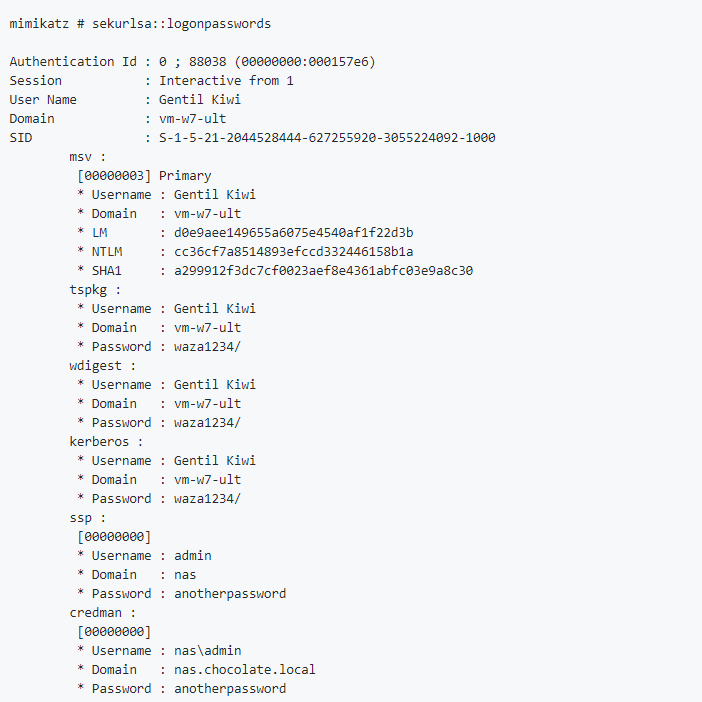
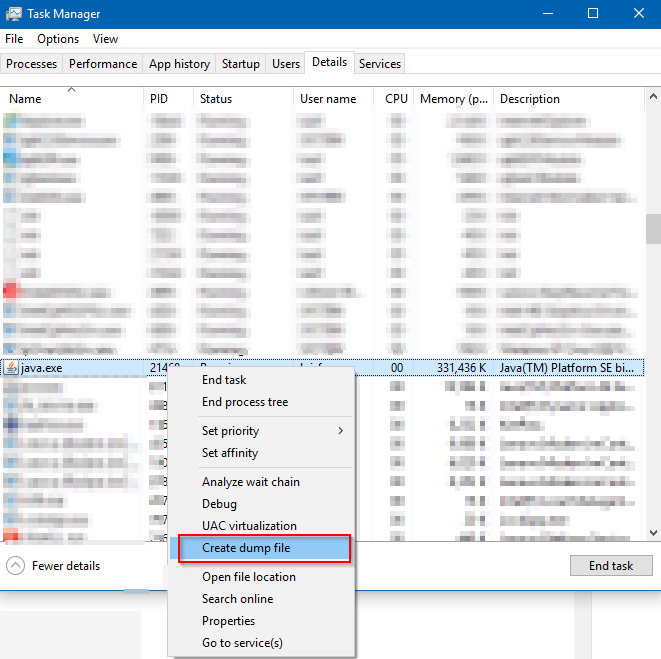
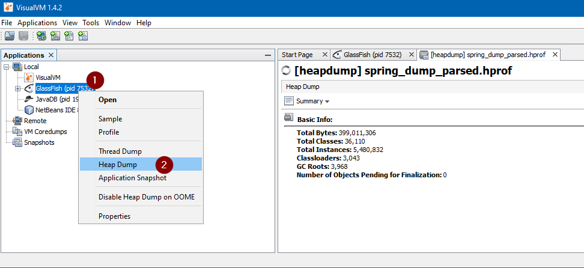
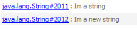
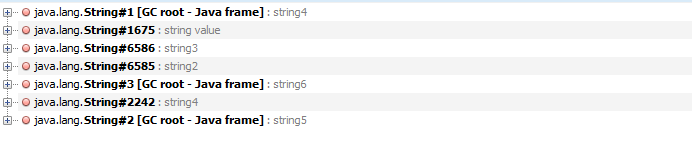
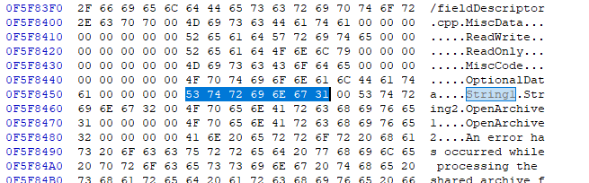
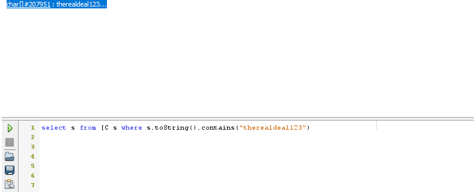

Heap Inspection is a vulnerability that most of the times developers don't care about, since it is not easy to mitigate, and most of libraries/frameworks are not prepared to handle it.

### So what is Heap Inspection?

Basically it's just when you get access to a machine and get access to process memory data. Then you can search for passwords or other sensitive information.

The prevention for this is to have sensitive information in memory as less time as possible, and even encrypted if needed. When you don't need the information, discard it.

Why is this underrated?

First, you need to have access to the machine. If you have a website, the attacker needs to gain access to the server that hosts it (most of the times).

Ok, so let's see a really exploitation of this vulnerability, that has a high impact on the target system.

A few years ago, when an attacker gained access to a Windows machine, one common task to do was to extract the users' hash password from the SAM file. Then they needed to bruteforce the hash, to retrieve the real password. This brute force could take from hours to days or years.

Nowadays attackers have a much easier way to retrieve user passwords, since windows needs them to be in memory.  
So Mimikatz was created. This tool is known for extracting users' passwords from memory in plaintext.

[](images/image-23.png)

This is one of the most extreme exploitations of this vulnerability.

### How to dump process memory

Lets start by seeing how you can dump the heap of a process.  
The easiest way is by using the task manager:

[](images/image.png)

Then you can use hex editors like HxD (in windows) to open and search the file.

### Java Example

Lets take a look at a small java application to understand how does Heap Inspection happen, and how to prevent it.

First you need to know that a String in java is usually immutable.  
What this means is that, if you have String a = "hello"; and you change a to a = "hello world" you will end up with two strings in memory. "hello" and "hello world", since the string cannot be changed.

Every time you 'change' a string, a new instance is being created in memory and assigned to that variable. (we are going to see bellow the exceptions)  
The problem is that the old strings are not cleaned up.

Take a look at the next example

```java
package heapinspection;

import java.util.Scanner;

public class OverrideString {

    public static void main(String\[\] args) {
        String s = "Im a string";
        s = "Im a new string";
        
        new Scanner(System.in).next();
    }
}
```

In the example above I created the string s and then overwrite its value. The scanner is just to prevent the code from closing too soon.

Now we need something to dump the heap. I'm not going to use task manager, first because only works on windows, second because we have better ways to do this in java.

I'm going to use a tool called [**VisualVM**](https://visualvm.github.io/download.html). You can dump the heap by code and import to VisualVM or just dump it in VisualVM which is the approach i'm going to.  
I have an example on how to do dump through source in the source code at the end of the post.

You can also use jhat for example, which is a tool that comes with java installation that can be used to navigate the dumps

Run the app, and while opened, go to VisualVM

On the left side identify the process of your application, right click it and hit "Heap Dump"

[](images/image-11-1.png)

This will generate a dump bellow the process.  
To see the objects of your app follow the next image:

[](images/image-3-1-1024x485.png)

As you can see there are a lot of objects here.

For this scenarios I usually switch to the "OQL Console" to use a really unknown and undocumented query language: OQL.

Unfortunately I'm not an expert on it so i can't go into much details about it either.

Switch to the console and lets search in the dump for our strings:

[](images/image-10-1-1024x383.png)

And in the console and the bottom paste this:

select s from java.lang.String s where s.toString().contains("Im a")

This is a query to find strings that contain the text "Im a"

And as you can see we found two:

[](images/image-5-1.png)

We now know for sure that when 'changing' a string what happens down the hood is that a new instance is created.  

### **What about Garbage Collector?**

Take a look at this example:

```java
package heapinspection;

import java.util.Arrays;
import java.util.Scanner;

public class StringLiteralNewStringAndGC {

    public static void main(String\[\] args) {
        doIt();
        
        System.gc();
        
        String s4 = new String("string4"); 
        String s5 = "string5"; 
        
        char c2\[\] = {'s', 't','r','i','n','g','6'};
        String s6 = new String(c2); 
        Arrays.fill(c2, '0');
        
        new Scanner(System.in).next();
    }
    
    private static void doIt(){
        char c\[\] = {'s', 't','r','i','n','g','1'};
        String s = new String(c); 
        Arrays.fill(c, '0');
        
        String s2 = "string2"; 
        
        String s3 = new String("string3"); 
    }
}
```

First of all I need to explain the different ways that strings are being created in this sample to understand how affects heap inspection.

Lets start by s2 (in doIt) method. This is a String Literal. String literals are not garbage collected and are immutable.

**String s** is being created with an instantiation with a char array as a parameter. This is not a string literal, can be garbage collected and its muttable.

String s3 has a string literal and is creating a new instance of a string. So in this scenario we have 2 strings. A literal and one which is not literal. Garbage collector only removes one of the two "string3" in memory.

Also note that on strings s and s6 if you assign a new string the old value will be overwritten since they are muttable.

Close the other example, run this one, dump it on VisualVM and search for the strings:

select s from java.lang.String s where s.toString().startsWith("string")

[](images/image-6-2.png)

Notice that string1 is not showing up. It was garbage collected, great!

String2 still there. Again, string literals are not garbage collected.

String3 still there as well, but since we created two strings, one of them was garbage collected. We can be sure if we look for string4 which is the same scenario but not affected by GC, and it has 2 instances.

Also, garbage collector only worked because s,s2 and s3 were on a different method. If they were on the same GC would leave them alone.

Now for the most important part, and this is where a lot of people get it wrong. **Garbage collector does not clean memory**, it **only releases objects**.

In other terms, it says that specific addresses in memory can be rewritten, that the content there is not important anymore, but the content stays in memory until it gets overwritten.

Lets make sure of it. Go ahead and dump the process from the sample above through process manager.  
In Linux I believe you can use programs like gcore (i'm sorry but I didn't test it ).

Now lets open the dump in an hex editor. I like to use HxD

If you do a find for the content String1 you will find it there:

[](images/image-7-2.png)

So to prevent strings from staying in memory we can create a string with the new keyword with a char array as a parameter (that you need to clear), and when you don't need it set it to null (or run GC).  
An easier way is to just use the char array and clear it afterwards.  

This is a reason when using crypto related methods, keys are sent as byte\[\] or char\[\] and not as a String.

### Preventing Heap Inspection

Lets then see (again) how to prevent this with a char array:

```java
package heapinspection;

import java.util.Arrays;
import java.util.Scanner;

public class ClearArray {

    public static void main(String\[\] args) {
        
        char\[\] t2 =
        {
            'c', 'h', 'a', 'r', 'a', 'r', 'r', 'a', 'y', '2'
        };

        //this will be cleared
        Arrays.fill(t2, '0');
     
        new Scanner(System.in).next();
}
```

In this example we are creating an array and replacing all positions with a zeros  
  
Let's run it and check again the dump

```sql
select s from \[C s where s.toString().contains("chararray2")
```

Nothing found... But now if you look for the zeros:

```sql
select s from \[C s where s.toString().contains("000000000")
```

Here it is :D

If you need to add extra security on top of that you can use GuardedString, or SealedObject which basically keep data encrypted in memory, but GuardedString keeps the key in memory and SealedObject puts cipher management on your side, so at the end it's not much, but it's something. It adds a security layer and may get unnoticed.

### **And what about WebApps?**

So this is probably the part that you are really interested...

Lets take a look at the following snippet of a Spring MVC controller:

```java
package com.securitywhitepapers.heapinspection.controller;

import com.securitywhitepapers.heapinspection.model.User;
import com.sun.management.HotSpotDiagnosticMXBean;
import java.io.IOException;
import java.lang.management.ManagementFactory;
import java.util.logging.Level;
import java.util.logging.Logger;
import javax.management.MBeanServer;
import org.springframework.http.MediaType;
import org.springframework.stereotype.Controller;
import org.springframework.web.bind.annotation.RequestBody;
import org.springframework.web.bind.annotation.RequestMapping;
import org.springframework.web.bind.annotation.RequestMethod;
import org.springframework.web.bind.annotation.ResponseBody;

@Controller
@RequestMapping(value = "index")
public class IndexController {

    @RequestMapping(method = RequestMethod.POST, consumes = MediaType.APPLICATION\_JSON\_VALUE)
    @ResponseBody
    public String parsedBody(@RequestBody User user) {
        user.cleanPassword();
      
        return "";
    }
}
```

This is quite simple: An endpoint that receives an object of type User, that only has a password as a char array. cleanPassword method sets all char array positions as 0

Should get things done right? Let's check it.

You can test a request with curl:

```bash
curl -X POST -H "Content-Type: application/json" --data '{"password": "therealdeal123"}' http://localhost:8080/SpringMVC/index
```

Open the dump in VisualVM and search for the array:

```sql
select s from \[C s where s.toString().contains("therealdeal123")
```

And the output:

[](images/spring_parsed_body_clean_vulnerable.png)

As you can see there's still heap inspection... Maybe I didn't clean it right?

```sql
select s from \[C s where s.toString() == "00000000000000"
```

[](images/image-8-2.png)

Looks like I did...  
So how can we clean that extra string? As far as I know, you can't ...

Really? All of this to tell that we can't?

Yes :)  
  
You need to wait until these internal variables get overwritten in memory.

Is this only happening because of Spring?

No. This also happens with normal servlets for example. If you have a parameter in the request you are already done, because parameters are always strings. You can open a reader for the body, parse the body with an array buffer, do what you need to do, close the reader and clean the buffer. You solved the problem from your side, you still have other variables from the GlassfishServer or from the Servlets.

Have in mind that even if you could just clean all the variables, if an attacker does a dump of the process in the exact moment you receive a password into a char array it will be able anyway to see it. So at the end, the best approach is to have passwords in clear text in memory as less time as possible since there is no way to completely solve this problem.  

### Long story short

Heap inspection is really difficult to prevent, and most of times is impossible.

You can reduce the risk of exposure, by keeping sensitive data in memory as less time as possible and make sure you clear the content, by using char arrays instead of strings and clear them after usage.

If dealing with passwords, you can receive them already hashed from client side, and [hash](https://thesecurityvault.com/appsec/secure-password-hashing/) them again before going to the database.

Keep sensitive information encrypted in memory, as an extra layer of security.
