This time i'm not going to talk about a specific vulnerability. Instead I'm going to show how attackers disguise malware in order to bypass antivirus.

### Antivirus 101

To start, we need to understand how AV works.  
I'm just going to touch on the basics, but they should be enough to understand the logic behind all of this.

To know that a malware is actually a malware the AV checks an internal database where it stores what is called a signature. This signature is a peace of the malware, that should be unique to that program. In a lot of scenarios these signatures are strings or checksum hashes from the binaries.

Lets see an example.  
Someone writes ransomware that encrypts all the disk and at the end writes a file to the desktop with the content: "Haha you are now a victim of TheGreatAndAwesomeRansonwareTheBestInTheWorld pay or loose everything". Nice file hum?  
So an AV vendor may choose to add the print of this string as the virus signature. So if it finds it on a file, it will say that file is the TheGreatAndAwesomeRansonwareTheBestInTheWorld ransonware.

The biggest disadvantage of this approach is that AV vendors need to know the malware, to flag it in the AV.  
This is why they usually use what is called HoneyPots. A HoneyPot is a fake vulnerable public machine that is expected to be exploited. From the exploit the AV vendor can find new malware, and new techniques, then just need to add them to the AV.  
Nowadays a lot of attackers also use HoneyPots, to mess with other attackers, to find themselves new malware, to learn new stuff, etc.

#### ClamAV

To reallyunderstand how an antivirus operates we need to see one working  
I'm going to use ClamAV to do demos since it is a free and opensource antivirus, and its awesome for testing this kind of stuff.

In a bash terminal (debian based), you can install it like:

```bash
sudo apt-get install clamav
sudo freshclam #to update (first get gets all virus info)
```

There is also a daemon to run it, but since we don't need it for tests, I'm leaving it alone

To do a quick test we are going to use the old ILOVEYOU virus.  
Actually I dont recall it from my time (probably I was too young to hear about viruses) but I found the code on github, which I'm trusting its the right one :)  
I did a fork of it, and you can find it [here](https://github.com/TheSecurityVault/ILOVEYOU)

Download it to your machine like so:

```bash
cd /tmp
wget https://github.com/thesecurityvault/ILOVEYOU/blob/master/LOVE-LETTER-FOR-YOU.TXT.vbs
```

##### ClamAV Basics

Since we need to understand how AV's work I'm going to spend some time explaining ClamAV. Its opensource, there's (good) public documentation, and its really nice to see it working :)

We need to get to the ClamAV databases so, lets see where they are.  
Usually there's a file /etc/clamav/freshclam.conf that can tells us that. Cat it:

```bash
cat /etc/clamav/freshclam.conf
````

[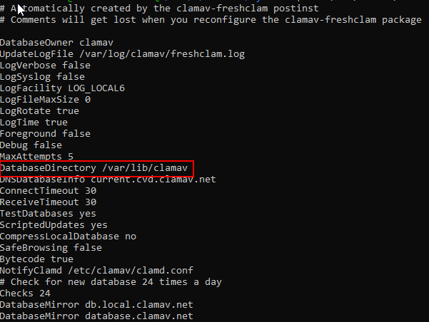](images/image-6.png)

You will get something like the image above. And the property "DatabaseDirectory" tells you where the db's are.

You are going to find some files like:

- bytecode.cvd
- daily.cvd
- main.cvd
- mirrors.cvd

For now lets focus on main.cvd and daily.cvd

For us to be able to read the info from these files we need to extract them with a tool provided by ClamAV called sigtool like so:

```bash
sigtool -u /var/lib/clamav/main.cvd
sigtool -u /var/lib/clamav/daily.cvd
```

You now have a lot of files with different extensions:

I will cover some of them through this article, but if you want to get more information about it check official docs [here](https://www.clamav.net/documents/creating-signatures-for-clamav).

All set, lets test the ILOVEYOU against ClamAV:  

clamscan LOVE-LETTER-FOR-YOU.TXT.vbs

We get the following results:

[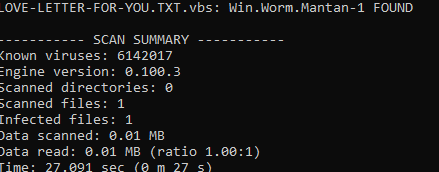](images/image-12.png)

##### ClamAV Signatures

Ok, so ClamAV identified ILOVEYOU worm, but how?  
Lets see which signatures identified the virus  
We can do it with sigtool as well, with the following command:

```bash
sigtool --find-sigs Win.Worm.LoveLetter-16
```

Where "Win.Worm.LoveLetter-16" is the identifier ClamAV gave us for ILOVEYOU

[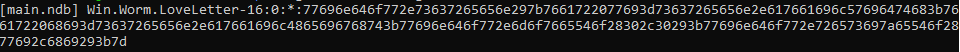](images/image-13.png)

Right at the beginning we can see that the signature is stored in main.ndb but unfortunately the signature is in hex, which is not that pretty to look at.

This is how AV's process files. They don't care about being human readable, in fact, they cannot be worried with that. If they are looking for a specific pattern in a binary file, they cannot translate it... That is why everything is in hex internally. An AV opens a file in hex, and compares their hex signatures.  
Anyway, lets "pretty print" it:

```bash
sigtool --find-sigs Win.Worm.LoveLetter-16 | sigtool --decode-sigs
```

[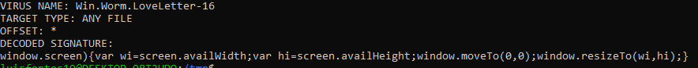](images/image-14.png)

Much better now.  
The interesting part is the "DECODED SIGNATURE" section

This is the actual human readable ClamAV signature for the ILOVEYOU worm. In other words this is how ClamAV identifies the malicious file.  
If you look at the code you will find this snippet in line 329.

##### Bypassing ClamAV signature

So if the AV uses this line to identify ILOVEYOU what about if we change it?  
Replace that line (329) by the following two lines:

```vb
    & vbcrlf & _ "If (window.screen)" 
    & vbcrlf & _ "{var wi=screen.availWidth;var hi=screen.availHeight;window.moveTo(0,0);window.resizeTo(wi,hi);}"
````

The only thing done here, was separating the line in two separated lines, keeping the same behavior. Run it again through the anti virus:

[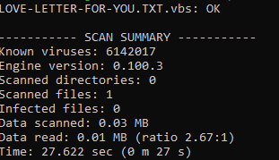](images/image-15.png)

We bypassed ClamAV but this does not necessarily mean that we bypassed any other AV. Each vendor has its own signatures, their own way of identifying malware.

VirusTotal is a website that runs the supplied file through around 50 different AV products and shows their results. We can test ILOVEYOU there to see the results  

This is the result for ILOVEYOU worm:

[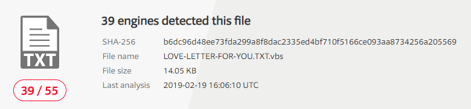](images/image-16.png)

[VirusTotal Scan](https://www.virustotal.com/#/file/b6dc96d48ee73fda299a8f8dac2335ed4bf710f5166ce093aa8734256a205569/detection)

38 out of 55 AV solutions found ILOVEYOU

If we now upload the changed version lets see what happens:

[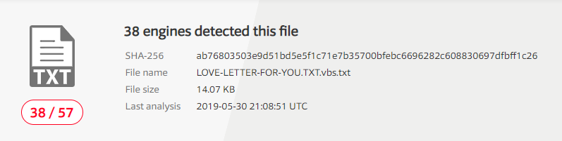](images/image-17.png)

[VirusTotal Scan](https://www.virustotal.com/#/file/ab76803503e9d51bd5e5f1c71e7b35700bfebc6696282c608830697dfbff1c26/detection)

Here we have it. 38 out of 57. Signatures are different on other AV's and that's why we could only bypass ClamAV.

##### ClamAV & Eicar

Lets test a different scenario. For this we are going to use the EICAR test file. This is nothing more then a text file defined as a standard for testing AV's. This means that every compliant AV vendor added signatures for this file in their AV's even not being malicious. Again, is a way of testing if the AV is working properly.

Lets download the file from its original source and scan it:

```bash
wget https://secure.eicar.org/eicar_com.zip
unzip eicar_com.zip
clamscan eicar.com
```

[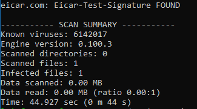](images/image-18.png)

To get the signatures associated with this file (to be recognized) run sigtool again:

```bash
sigtool --find-sigs Eicar-Test-Signature
```

[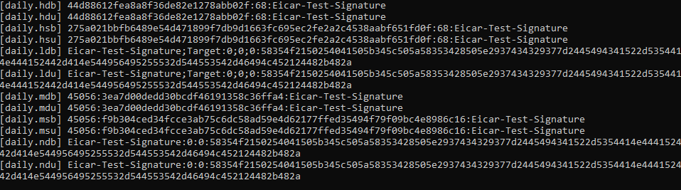](images/image-19-1.png)

As you can see there are a lot of signatures in all ClamAV files. I'm just going to explain two of them, since the logic is similar to all.

The first one is in daily.hdb and this file has the md5 hashes of the files. What this means is that ClamAV did an md5 checksum of the file, and found the same hash.

We can make sure thats the case by using one of the following commands:

```bash
sigtool --md5 eicar.com
md5sum eicar.com
```

They both, return the same hash: `44d88612fea8a8f36de82e1278abb02f`  
Now we have a different scenario from the first time. With ILOVEYOU the AV was looking for a specific file content while with eicar its looking for the signature of the file.  
This means that if we change the file content, the checksum will be different, and so ClamAV wiill not find it.

Open eicar.com and change it'ts content. I just added an 'a' at the begining. Then do the checksum again:

```bash
sigtool --md5 eicar.com
md5sum eicar.com
```

And we have a new hash: `0ce164bf3975aa4b75bb5a5a15b73cbe`

Running a new scan, its not flagged anymore:

[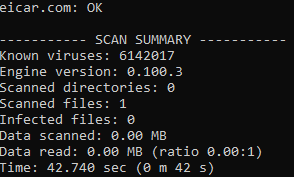](images/image-20.png)

#### Why signatures are bad

Using file hash as a signature may be quite effective if you don't have access to the code to manipulate it.

If its like a c# application that you can easily reverse and rebuild that's not that great. Or if you have the source code of a known malware that you can just change.

And that is exactly what happened to me at this point of writing.  
I went to github, download the hidden tear ransomware, which is a nice open source project (with deliberated programming flaws, so it won't be that dangerous since its purpose is educational).

I wanted to show on a real and nice example how to change a malware source code to bypass antivirus  
So I downloaded the code and compiled it with Visual Studio. For my surprise ClamAV is using an Hash based Signature for hidden tear. Which means that it only stores the hash of the compiled binary. So when I compiled it and scan it it didn't find anything. The source code is the same, no changes, but if, for example, the .net framework version is different from the one used to create the signature the output executable will also be different. I had to do nothing to bypass this detection, good :)

So I downloaded the code and compiled it with Visual Studio. For my surprise ClamAV is using an Hash based Signature for hidden tear. Which means that it only stores the hash of the compiled binary. So when I compiled it and scan it it didn't find anything. The source code is the same, no changes, but if, for example, the .net framework version is different from the one used to create the signature the output executable will also be different. I had to do nothing to bypass antivirus this time, good (or not):)

Lets try to test this with another real and nice scenario then.

#### Bypassing Meterpreter signature

(if you don't know what is [metasploit](https://www.metasploit.com/) and meterpreter you don't know what you are missing)

Lets download meterpreter java payload and compile it. You can find the source code on [github](https://github.com/rapid7/metasploit-payloads/):  

```bash
git clone  https://github.com/rapid7/metasploit-payloads/ 
cd metasploit-payloads/java
mvn compile
mvn package
```

Note: This payloads still use JDK 1.5, which was not supported with my current java version, so I had to replace all occurrences of 1.5 to 1.6 at least :)

K, now we have our meterpreter payload at metasploit-payloads/java/javapayload/target

To make sure it gets caught by ClamAV lets start scan it:

```bash
clamscan javapayload/target/Metasploit-JavaPayload-1-SNAPSHOT.jar
```

Great, still vulnerable.  
Now, how to bypass antivirus here?

Just for context lets see what clamAV uses to flag this payload:

```bash
sigtool --find-sigs Win.Tool.MeterPreter-6294292-0 | sigtool --decode-sigs
```

```txt
VIRUS NAME: Win.Tool.MeterPreter-6294292-0
TDB: Engine:51-255,Target:1
LOGICAL EXPRESSION: 0&1&2&3&4&5&6&7&8
 * SUBSIG ID 0
 +-> OFFSET: ANY
 +-> SIGMOD: NONE
 +-> DECODED SUBSIGNATURE:
metsrv.dll
 * SUBSIG ID 1
 +-> OFFSET: ANY
 +-> SIGMOD: NONE
 +-> DECODED SUBSIGNATURE:
core_update_thread_token
 * SUBSIG ID 2
 +-> OFFSET: ANY
 +-> SIGMOD: NONE
 +-> DECODED SUBSIGNATURE:
core_update_desktop
 * SUBSIG ID 3
 +-> OFFSET: ANY
 +-> SIGMOD: NONE
 +-> DECODED SUBSIGNATURE:
packet_create
 * SUBSIG ID 4
 +-> OFFSET: ANY
 +-> SIGMOD: NONE
 +-> DECODED SUBSIGNATURE:
scheduler_initialize
 * SUBSIG ID 5
 +-> OFFSET: ANY
 +-> SIGMOD: NONE
 +-> DECODED SUBSIGNATURE:
scheduler_insert_waitable
 * SUBSIG ID 6
 +-> OFFSET: ANY
 +-> SIGMOD: NONE
 +-> DECODED SUBSIGNATURE:
channel_create_stream
 * SUBSIG ID 7
 +-> OFFSET: ANY
 +-> SIGMOD: NONE
 +-> DECODED SUBSIGNATURE:
channel_write_to_remote
 * SUBSIG ID 8
 +-> OFFSET: ANY
 +-> SIGMOD: NONE
 +-> DECODED SUBSIGNATURE:
buffer_from_file
```

Its looking for specific keywords like metsrv.dll and scheduler_initialize. This look like method or variable names or strings... So we can just refactor variables/methods, and change strings (most of the time, splitting them into two strings works, or you can change specific chars and then do a replace no make it right again).

Tbh I'm too lazy to be manually changing all of this, so I downloaded ProGuard which is a Java obfuscator and does basically what we need. Refactor methods, variables and can even obfuscate strings.

I'm not going into details on how to handle proguard.

I just ran everything with default settings, and exported my new meterpreter payload to obfuscated.jar. Lets run a new scan:

[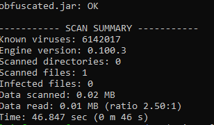](images/image-21.png)

No findings... Great, we just bypassed AV with a real thread.

But don't get crazy yet...

Other AV's still catch it. Check the VirusTotal report:

[](images/image-22-1024x478.png)

A lot of times, evading AV's is just about evading the AV the victim is using, don't need to evade all.

In this case since we do not know the signatures used by the other AV's we would need to keep refactor code until it gets completely undetected:  
Separate instructions into multiple statements, add random method calls between complex logic, obfuscate strings, change variables, method names, etc.

This is it for the first article. I covered a lot of stuff already.  
I'll be writing another post with more complex AV logic like the sandbox and some bypass techniques
