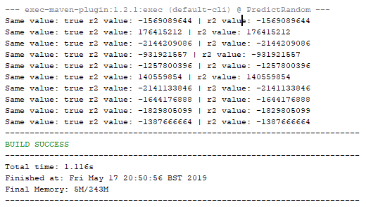
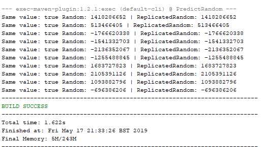
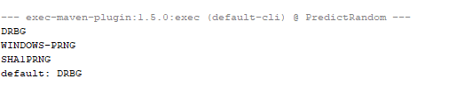

A lot of developers don't know that regular Random is a weak random implementation. In fact its quite predictable. A lot of code relies on this class to generate passwords, tokens and other security related values, that in fact end up not being secure at all.

I'm going to focus on Java, but a lot of the concepts are the same for other languages

### How Java (weak) Random Works

There are some nice articles about this on the net, the one that caught my eye when learning about this a long time ago was the one from [Franklin To](https://franklinta.com/2014/08/31/predicting-the-next-math-random-in-java/). This is an awesome article explaining how he replicated the Random class from java. Its quite easy to understand and I recommend everybody to read it.

So to explain how this works, basically java [Random class](http://hg.openjdk.java.net/jdk8/jdk8/jdk/file/tip/src/share/classes/java/util/Random.java) uses a [Linear Congruential Generator](https://en.wikipedia.org/wiki/Linear_congruential_generator) (LCG) which is a really nice and old algorithm that generates numbers in a way that for the human eye look like random. The formula is as simple as:

`xn = a * xn-1 + c mod m`

Where x0 needs to be defined manually since its the first value. and a,c and m are predefined constants.  
In java, by default, the first x value ( x0 ) is seeded from current time in milliseconds with a small operation on top of it. But you can change the seed. Lets see an example:

```java
package com.securitywhitepapers.predictrandom;

import java.util.Random;

public class SameSeed {

    public static void main(String[] args) {
        
        Random r1 = new Random(1111);
        Random r2 = new Random(1111);
        
        for(int i = 0; i < 10; i++)
        {
            int v2 = r2.nextInt();
            int v1 = r1.nextInt();
            
            System.out.println(String.format("Same value: %b r2 value: %d | r2 value: %d", 
                    v1 == v2, v1, v2));
        }   
    }
}
```

[](images/image-3.png)

If you run this peace of code you will see that both weak random instances will always return the same values because they have the same seed.

If you look at the LCG algorithm that is understandable. The x0 which is our seed is the same in both instances. a,c and m are static and hardcoded so we have exactly the same formula for both instances.

If you change the seed from one of the instances, or if you remove them results will be different.

### Replicating Java Random

So we now have a fair understanding how this works, but you are probably thinking that you still need to guess the exact time the weak Random instance was created to get the seed, or guess the seed of an application so that you could replicate the random.

In fact its quite easy to guess the seed having the right amount of samples (when using Random.nextDouble in java, you just need one sample, and Random.nextInt you need just two).  
I will not get into details since this is not my expertise, but you can refer to the first link I used, or the ones in the references.  
  
To demonstrate this, I will use the [code](https://github.com/fta2012/ReplicatedRandom) provided by [Franklin To](https://franklinta.com/2014/08/31/predicting-the-next-math-random-in-java/) in his article

You can just copy paste the class "ReplicatedRandom" from github and put it on your project, then you can use the following code:

```java
package com.securitywhitepapers.predictrandom;

import java.util.Random;

public class Replicate {

    public static void main(String[] args) {
        
        Random r = new Random();
        ReplicatedRandom rr = new ReplicatedRandom();
        
        //assuming we got to know 2 sequential "random" values generated
        rr.replicateState(r.nextInt(), r.nextInt()); 
        
        for(int i = 0; i < 10; i++)
        {
            int randomValue = r.nextInt();
            int replicatedValue = rr.nextInt();
            
            System.out.println(String.format("Same value: %b Random: %d | ReplicatedRandom: %d", 
                    randomValue == replicatedValue, randomValue, replicatedValue));
        }
    }
}
```

When you run it, you will see that it generates the same values.

[](images/image-4.png)

There are also other tools that help you "guess" the next numbers from weak Random, like [Foresight](https://github.com/ALSchwalm/foresight) for multiple scenarios

So regular Random is quite easy to predict. What are the alternatives?

### Secure Random

SecureRandom is your way to go.

But how does then SecureRandom garantees an unpredictable random value? We need to understand how the class works first :)

SecureRandom has multiple algorithms to get random bytes. Lets see them.  
Run the following java code:

```java
package com.securitywhitepapers.predictrandom;

import java.security.SecureRandom;
import java.security.Security;
import java.util.Set;

public class SecureRandomAlgorithms {

    public static void main(String[] args) {
        final Set<String> algorithms = Security.getAlgorithms("SecureRandom");

        for (String algorithm : algorithms) {
          System.out.println(algorithm);
        }

        final String defaultAlgorithm = new SecureRandom().getAlgorithm();

        System.out.println("default: " + defaultAlgorithm);
    }
}
```

This will show you the available algorithms that java has for your system as well as the default one.

I'm using a Windows machine so mine are:

[](images/image-5.png)

If you run on a Unix based environment you will see much more options like [NATIVEPRNG](https://github.com/frohoff/jdk8u-jdk/blob/master/src/solaris/classes/sun/security/provider/NativePRNG.java), NATIVEPRNGBLOCKING and NATIVEPRNGNONBLOCKING.

Lets start by explaining the Unix ones.

#### NATIVEPRNGBLOCKING

NATIVEPRNGBLOCKING makes use of /dev/random which is a file [fed by the OS](https://elixir.bootlin.com/linux/latest/source/drivers/char/random.c) with random data from multiple souces. It collects "noise" from drivers, interrupts, etc.

At the end you get unpredictable values. /dev/random works with what is called an entropy pool, where API's get the values from. When this pool runs out of data, you will have to wait until new data is generated, and since this uses hardware based events and others, this can take some time. This is why /dev/random is blocking. If no data is available you will have to wait until it has the necessary data.

#### NATIVEPRNGNONBLOCKING

On the other hand, you have [/dev/urandom](http://man7.org/linux/man-pages/man4/urandom.4.html) (used by NATIVEPRNGNONBLOCKING) which is non blocking. This means that you won't have to wait for new random data. It uses /dev/random to get a seed to feed a PRNG algorithm.  
If it can't get a seed then theoretically, since this is non-blocking, it will return a [preditable value](https://linux.die.net/man/4/urandom)

NATIVEPRNG is configurable through the java.security file and usually uses /dev/random.  
This is the default configuration, and its safe :)

Lets now take a quick look at the available options for windows.

#### WINDOWS-PRNG

WINDOWS-PRNG uses [native crypto api](https://docs.microsoft.com/en-us/windows/desktop/api/wincrypt/nf-wincrypt-cryptgenrandom)'s from windows to return random data, which is also considered safe. If you send the same seed to two different instances the output will be different.

#### SHA1PRNG

Lets move to SHA1PRNG. This one is available on all systems since its a pure java implementation. The security of this algorithm is directly linked with the source of entropy. Two instances with the same seed generate the same value. Also a lot of experts in the field have [claimed](https://android-developers.googleblog.com/2016/06/security-crypto-provider-deprecated-in.html) this method is not that secure.

This is also the default algorithm selected for windows environments prior to Java version 9.

So if you are using a windows system you should always change the default algorithm:

```java
package com.securitywhitepapers.predictrandom;

import java.security.NoSuchAlgorithmException;
import java.security.SecureRandom;
import java.util.logging.Level;
import java.util.logging.Logger;

public class SafeSecureRandomWindows {

    public static void main(String[] args) {
        try 
        {
            SecureRandom sr = SecureRandom.getInstance("WINDOWS-PRNG");
        } 
        catch (NoSuchAlgorithmException ex) 
        {
            Logger.getLogger(SafeSecureRandomWindows.class.getName()).log(Level.SEVERE, null, ex);
        }
    }
}
```

##### DRBG

From Java 9 and above you now have a new option: DRBG (from Deterministic Random Bit Generator and this is the **new default for windows environments**. There are some nice options you can configure from the java.security file, but the defaults are good

#### **;TLDR**

- Random is unfit for security related stuff, or other scenarios where you need unpredictability
- SecureRandom is the way to go
- Default SecureRandom algorithm in windows is SHA1PRNG for Java 8 and bellow
- SHA1PSRNG is unsafe, don't use it.
- Don't seed SecureRandom unless you really (really) know what you are doing

You can find a project's source code with some tests [here](https://github.com/TheSecurityVault/random)
