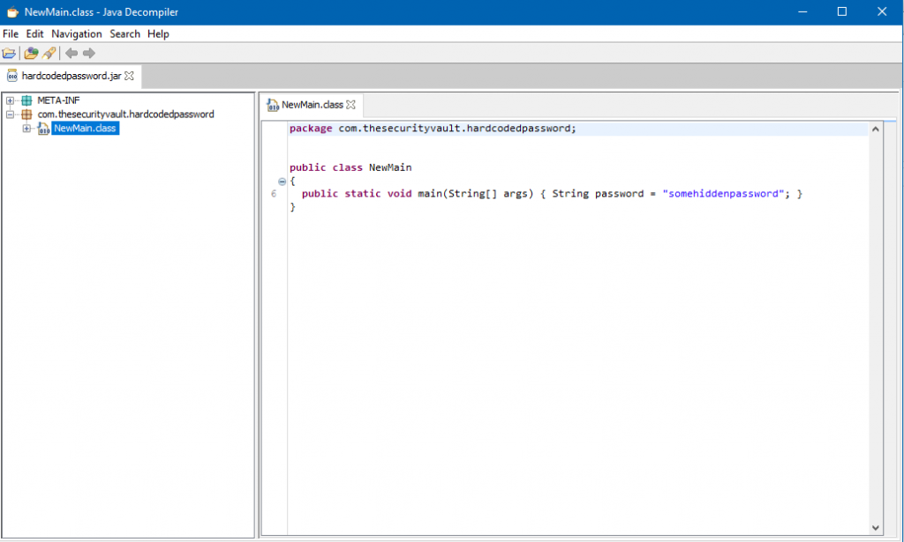

Hardcoded passwords... This is a problem quite common, and most of the projects that I get my hands on have a hardcoded password somewhere.

But, what's the problem of having for example the password of the database in the code?

Well, actually, a lot!

Lets start by the most straightforward scenario. Hardcoded passwords, (and when I say passwords I mean credentials, not just passwords) get into source control. From there its impossible to remove. If you share source control between all the developers, if you open source the project, everybody with access to it can see those credentials, and depending on the scenarios use them to login on a service. If you are concerned with [Heap Inspection](https://thesecurityvault.com/heap-inspection) its also bad.

As you can imagine there are tons of tools to search, for example, in github to find passwords commited in the code. A simple google search can give a good list:

- [https://github.com/zricethezav/gitleaks](https://github.com/zricethezav/gitleaks)
- [https://github.com/dxa4481/truffleHog](https://github.com/dxa4481/truffleHog)
- [https://github.com/kootenpv/gittyleaks](https://github.com/kootenpv/gittyleaks)

And you can even use github dorks to find passwords: [github-dorks](https://github.com/techgaun/github-dorks)

But you can use these techniques to help you preventing commits with passwords as well :)

Honestly I never tried this tools, but don't need to use them to know that you will find a lot of results. I see this problem on almost all projects I review.

The deployed version of the software will also have the keys hardcoded. Its not as bad if its a web application deployed on your server, for example. But if this is a desktop application the user can eventually get a hold on the password.

But there are much more scenarios why you should not hardcode passwords. Let's assume an attacker finds path traversal in your website. With some luck it can find a file that has hardcoded credentials, and again, depending on the scenario he could even login with those credentials on the service.

### Retrieving an hardcoded password from a binary

Theory aside lets see some examples on how this can be "exploited" and prevented.

Take a look at this super complex C code that just has an hardcoded password:

```c
#include <stdio.h>
int main()
{
   char *pwd = "super_password_not_that_secure";
   return 0;
}
```

Lets compile it:

```bash
gcc password.c -o pwd_program
```

And now have a binary file, user can't see the password right?

**Wrong**.

It's quite easy to retrieve for example strings from a binary. In linux you can do this with the strings command (there's an equivalent for windows from sysinternals:

```bash
strings pwd_program
```

You will get a list of strings, and the password will be there.

In a java .jar file it's even worse. Here you need to "guess" that a specific string is a password. Or dig much further to understand what the passwords are.

In Java doing an easy reverse engineering you get almost the original source code. Variable names and all. This makes much easier to figure out where passwords are.  
So I created this simple peace of code and built the jar file for it:

```java
package com.securitywhitepapers.hardcodedpassword;

public class NewMain {

    public static void main(String[] args) {
        String password = "somehiddenpassword";
    }

}
```

Now we can use a tool called [jd-gui](https://github.com/java-decompiler/jd-gui/releases) to easly reverse engineer the .jar file. You just need to drag it over:

[](images/jdgui.png)

And there's the password.

So if you plan to send a binary file to an user, with an hardcoded password you are doing it wrong.

### Avoiding Hardcoded Passwords

Now that we understand this lets see how on a server side app we can store and use passwords

#### On a Desktop Application

If you think you need to store some password that is not from the user, you are doing something wrong... If you have for example a Facebook app and you need to have the app id, you should not hardcoded it. You have a webservice that does that part. The desktop/client-side app communicates with your service and the webservice calls facebook app.

This is how you should proceed for almost scenarios.

#### On a backend application

To manage passwords on the backend there are some different techniques you can use, some more secure then others.

##### Feeding passwords to the application through the command line args

This is nice, since the password isn't stored anywhere, you depend on a user to type the passwords as an argument when starting the application, this can be bad, if the server reboots by any reasons. You would need to manually start the application

##### Saving passwords in environment variables

If you have a "secured" machine with restricted access you can just save passwords in environment variables. Although, people with access to the machine can see them. This is not that secure, but still better then hardcoded passwords.

If you want to add extra security, you can save them encrypted, and use command line arguments to get the decryption key. You will still have the same problem as the solution above where you need to manually start the app.

##### Saving passwords in config/properties files

You you create a config/properties file that is not going to source control. The file needs to be stored in a secure location outside the app source code, and restricted access only to the application that needs it. But storing passwords in plain text in config files is not a perfect solution for the same reasons as storing in environment variables

##### Secret Managers

Secret manager tools allow you to securely save keys in encrypted files, but you may still need at least a master password, or authentication to open the keystore, so again, where do you save that password?

If you use a store service like AWS secrets manager, then you don't need to worry with the password that encrypts all the secrets, you shift that responsibility to Amazon (in this case). This is the kind of approach I like the most, and what i'm using in a few projects hosted on AWS.

If you start combining these methods, you can also end up with a more robust solution. You can use a keystore to store the passwords needed by the application and store it on a safe place,then use a config file, or an environment variable to store the master key to the keystore. Again, its not perfect but its an extra layer of security

If you don't mind to write a solution for a specific OS, you can integrate with native tools such as Gnome Keyring or OSX keychain. Windows only has a built in certificate manager, you can't store passwords.

Also, don't forget about [heap inspection](https://thesecurityvault.com/appsec/heap-inspection/) when dealing with passwords in memory
