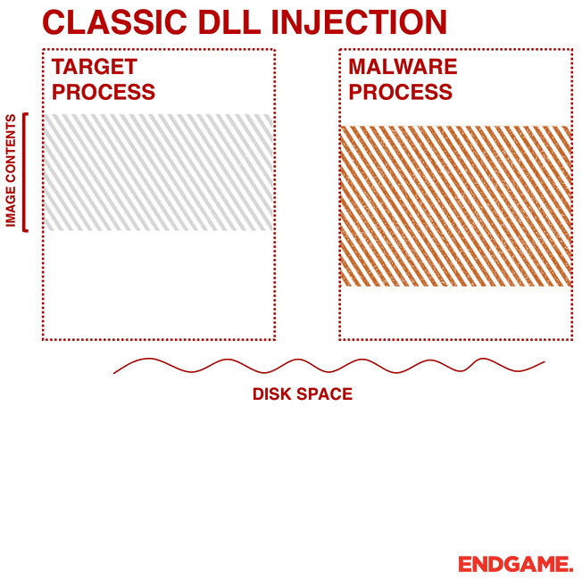
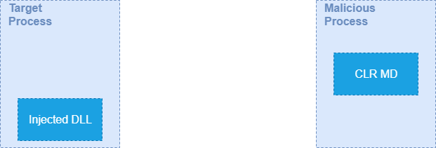

As discussed previously in [Heap Inspection post](https://thesecurityvault.com/heap-inspection/) keeping passwords and other sensitive data in memory may be insecure as they can be inspected or dumped.

Although it is almost impossible to completely mitigate [Heap Inspection](https://thesecurityvault.com/heap-inspection/) there are several techniques to reduce the time frame sensitive data keeps in memory, lowering the risk of exposure.

Lets review some of them:

- Don't store sensitive data as strings,
- Use char arrays, and override their values when not needed anymore
- Keep the data as less time as possible in memory
- keep data encrypted if needed
- Use as few instances of the data as possible

But besides these tricks there are also some constraints that will prevent you from doing it right:

- Most of libraries/frameworks are not prepared for this topic so they (only) use string parameters
- Webservers usually parse request data as strings so if you receive a password from an http request you are already done.
- Working with char arrays its much more complex and introduces a big development overhead

At the end you will probably end up having a string somewhere.

To try to help with this Microsoft introduced in .NET a feature called SecureString.

## What is SecureString?

SecureString is a class that provides ways to keep sensitive information encrypted in memory in an easy way.

Let's see how to use it:

```csharp
SecureString ss = new SecureString();
ss.AppendChar('T');
ss.AppendChar('h');
ss.AppendChar('e');
ss.AppendChar('S');
ss.AppendChar('e');
ss.AppendChar('c');
ss.AppendChar('u');
ss.AppendChar('r');
ss.AppendChar('i');
ss.AppendChar('t');
ss.AppendChar('y');
ss.AppendChar('V');
ss.AppendChar('a');
ss.AppendChar('u');
ss.AppendChar('l');
ss.AppendChar('t');

ss.MakeReadOnly();
```

## How does it work

This is the part that got me curious. If data is encrypted it needs to use a key to encrypt it, so where is the key saved? Can we get it? Can we find a way to decrypt the data?

Here I started digging into Microsoft documentation about SecureString, looking at the source code, and so on, and I found some nice information.

These are the main features of SecureString that are important to highlight:

**Properly disposes data**  
When data is not needed anymore SecureString clears the memory used, by zeroing it.

**Keeps data in unmanaged memory**  
This means that data in not kept in memory space managed by dotnet, which is good since GarbageCollector doesn't get to it.

**SecureString only works in Windows**  
It uses windows Crypto API so the encryption functionalities cannot be ported to other Operating Systems.

Encryption is done by calling [RtlEncryptMemory](https://docs.microsoft.com/en-us/windows/win32/api/ntsecapi/nf-ntsecapi-rtlencryptmemory) (in the classe's [source code](https://github.com/microsoft/referencesource/blob/3b1eaf5203992df69de44c783a3eda37d3d4cd10/mscorlib/system/security/securestring.cs) you find it in a call to Win32Native.SystemFunction041) from Advapi32.h

This is actually nice because you don't need to supply a password to it. Windows handles that for you. Otherwise you would need to worry with the encryption password in memory...

So the question now is what/who can decrypt it?

One of the parameters of the function call to encrypt the data specifies which processes can decrypt the encrypted data. This parameter has 3 options that mean:

- Any process can decrypt it
- Any process from the same user can decrypt it
- Only the same process can decrypt it

SecureString sets this parameter so that only the current process can decrypt it. This is nice.

## How to "break" it

Now that we have a good knowledge of how it works we can try to "break" it.

Since the encrypted data can only be decrypted by the process that encrypted it (at the end we will see this is not 100% true) we need to trick the application to decrypt the SecureString for us.

Lets see a simple application using a SecureString object, that we want to revert:

```csharp
using System;
using System.Security;

namespace BreakingSecureString
{
    class Program
    {
        static void Main(string\[\] args)
        {
            SecureString ss = new SecureString();
            ss.AppendChar('T');
            ss.AppendChar('h');
            ss.AppendChar('e');
            ss.AppendChar('S');
            ss.AppendChar('e');
            ss.AppendChar('c');
            ss.AppendChar('u');
            ss.AppendChar('r');
            ss.AppendChar('i');
            ss.AppendChar('t');
            ss.AppendChar('y');
            ss.AppendChar('V');
            ss.AppendChar('a');
            ss.AppendChar('u');
            ss.AppendChar('l');
            ss.AppendChar('t');

            ss.MakeReadOnly();

            Console.WriteLine("Generated SecureString object");
            Console.WriteLine("Press any key to exit...");
            Console.ReadKey();
        }
    }
}
```

As you can see, this is a really simple application that doesn't even have a method to get the cleartext password. So how can we do it?

Well, one way is to inject code into the target application. We can do this with [multiple code injection](https://www.endgame.com/blog/technical-blog/ten-process-injection-techniques-technical-survey-common-and-trending-process) techniques. For this case I chose DLL Injection.

[](images/dllinjection__0.gif)

(Image taken from [here](https://www.endgame.com/blog/technical-blog/ten-process-injection-techniques-technical-survey-common-and-trending-process))

Going into the details of how DLL Injection works is out of the scope of this post, but the source of the project that accomplishes this is at the end of the article, feel free to dig into it.

So the idea is to inject a DLL that has the necessary code to decrypt the SecureString instances. Sounds good but how can we get the reference for the variables, since we just injected new code?

Well, first thing that comes into mind is by using [Reflection](https://docs.microsoft.com/en-us/dotnet/csharp/programming-guide/concepts/reflection). Unfortunately you can't use it to get instances of a class.

So I came up with the idea of using the same techniques as a debugger. And Microsoft has a library called "[CLR MD](https://github.com/microsoft/clrmd)" for exactly that.

We can use this library to get the pointer address of the SecureStrings of the target application.

Then when invoking the DLL injected method we can send these pointers as parameters, get the object there and ask to decrypt the content.

[](images/securestrings2.gif)

.

### Explaining the code

Since there're a few files of code to make this work, I will not put the code in the post content , but you can find a reference for the source code at the end of the article.

There are 3 projects in the Solution:

- **VulnerableApp** - This is the target app, that we want to trick into decrypting the SecureStrings for us
- **MaliciousApp** - Name also speaks for itself. It injects the malicious DLL, uses the CLR MD to get the SecureString pointers, and invokes a method from the malicious DLL sending the pointers as parameters
- **DLLToInject** - The malicious DLL that will be injected into the VulnerableApp

**Important notes about the code:**

Your antivirus may catch this project as malicious, since DLL Injection is commonly used for bad purposes. Or it may only block it from running after a few times. (If you're interested in how AV's work, check [my post post here](https://thesecurityvault.com/how-antivirus-works-and-bypass-techniques-part-1/)).

For you to inject into another process there are two important things to have in mind:

- Target process needs to be in the same architecture as malicious app and DLL (x64 or x86).
- You need to have full control of the process, if you don't have enough permissions it will not work. Administrator account should work for most of the cases.

### Is SecureString recommended?

This is the question that really matters. If it's that easy to bypass its security should SecureString be used at all?

Microsoft has the following statement in their docs:

> We don't recommend that you use the `SecureString` class for new development. For more information, see [SecureString shouldn't be used](https://github.com/dotnet/platform-compat/blob/master/docs/DE0001.md) on GitHub.
>
> [Microsoft Docs](https://docs.microsoft.com/en-us/dotnet/api/system.security.securestring?view=netframework-4.8)

There are a few reasons for this. The API's that SecureString uses underneath are Windows specific, which mean that now with .NET Core if you are using SecureString in another OS they won't be encrypted.

And as we saw, the name can be misleading. SecureString is to be used as an extra security mecanism, where you don't store sensitive data in Strings, making it much easier to clean from memory, and thus, shortening the time for exploitation.

The encryption is only a precaution so that if, for example, an application crashes and windows generates a memory dump, the content of password and other sensitive data is not written in plaintext to the logs.

I believe that this note from Microsoft is due to the limitations that SecureString has in .NET Core. I see no problem using it as an **extra** security layer, as long as is not used to provide the needed security.

### Other attack vectors

There are already a few attack vectors for Windows Crypto API. For example NSA just recently disclosed [a 0-Day](https://www.schneier.com/blog/archives/2020/01/critical_window.html) related with certificates.

I just wanted to create a different attack vector, specific for SecureStrings, so I came out with the technique described in the article..

[Mimikatz](https://github.com/gentilkiwi/mimikatz), which is an awesome tool, can [decrypt Powershell PSCredential](https://twitter.com/gentilkiwi/status/1152687433525407745?lang=ar) (which contains a SecureString) by getting the original password used to encrypt the data. Lets see a quick example on how to do it.

First we need the Powershell SecureString object.

```powershell
Get-Credential |Export-CliXML -path 'securestring.xml'
```

Now, after downloading mimikatz from [here](https://github.com/gentilkiwi/mimikatz/releases) and running, type the following command:

```powershell
dpapi::ps /in:PATH\_TO\_YOUR\\securestring.xml /unprotect

And here you have the output:

UserName: TheSecurityVault
Password: \*\*BLOB\*\*
  dwVersion          : 00000001 - 1
  guidProvider       : {df9d8cd0-1501-11d1-8c7a-00c04fc297eb}
  dwMasterKeyVersion : 00000001 - 1
  guidMasterKey      : {49bf61cf-7898-45a4-92a0-012cb70d1fe2}
  dwFlags            : 00000000 - 0 ()
  dwDescriptionLen   : 00000002 - 2
  szDescription      :
  algCrypt           : 00006603 - 26115 (CALG\_3DES)
  dwAlgCryptLen      : 000000c0 - 192
  dwSaltLen          : 00000010 - 16
  pbSalt             : b70f39c018e17acda8c2a15fd0ef3c56
  dwHmacKeyLen       : 00000000 - 0
  pbHmackKey         :
  algHash            : 00008004 - 32772 (CALG\_SHA1)
  dwAlgHashLen       : 000000a0 - 160
  dwHmac2KeyLen      : 00000010 - 16
  pbHmack2Key        : 93d06c092b3bb6e3c71506f53511a28f
  dwDataLen          : 00000028 - 40
  pbData             : e7039975bd1af687ed8e266172c1f99480e443e4921dc20e45be396a6e608c05aafcf2ee210875f5
  dwSignLen          : 00000014 - 20
  pbSign             : 5e6ab77d1c5ffa22946b122998264dd4796ea6a9

 \* using CryptUnprotectData API
>> cleartext: InsecurePassword
```

Since it's not directly using the same API's from Windows as SecureString it is not limited to the same process restriction.

As mimikatz did this for PSCredential, the same techniques can be used for C# SecureStrings (although not supported)  
  
The source code for this project can be found on [github](https://github.com/TheSecurityVault/BreakingSecureString).
