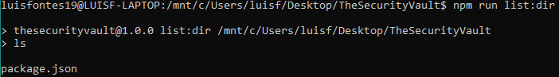
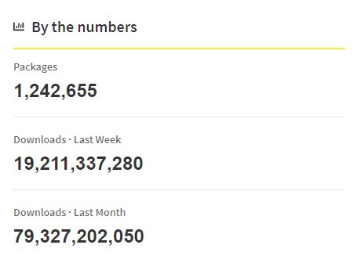
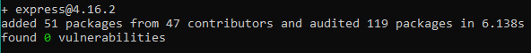
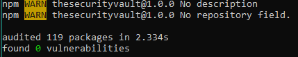

Javascript (and typescript) is now one of the most used languages in new projects. It has an awesome performance, and Promises came to improve it even more. With it came tons of new tools and projects like Node and NPM. But not all is good, the security of the NPM packages is a worrying problem. Lets talk about it.

NPM stands for "Node Package Manager" and its a really easy to use tool to get and install dependencies for our projects. But this ease of use can also be used by malicious users.

Lets start by creating a simple project:

```bash
npm init
````

I just created one with the default options and this is the package.json generated:

```json
{
  "name": "thesecurityvault",
  "version": "1.0.0",
  "description": "",
  "main": "index.js",
  "scripts": {
    "test": "echo \"Error: no test specified\" && exit 1"
  },
  "author": "",
  "license": "ISC"
}
```

Now looking at the scripts option. You can create your own scripts to run. This means that you specify a set of commands to run, OS commands.

I just added a new script:

```json
{
  "name": "thesecurityvault",
  "version": "1.0.0",
  "description": "",
  "main": "index.js",
  "scripts": {
    "test": "echo \"Error: no test specified\" && exit 1",
    "list:dir": "ls"
  },
  "author": "",
  "license": "ISC"
}
```

And if you run it, the ls command will be executed:

[](images/image-1.png)

### Executing commands without the user knowing

This is where things start to go south. You can create commands to do basically anything, but tricking an user of your module to run them is not that easy... first because they need to know the name of the script to run, and when they look at it they may find out that its doing something shady... But what if the user didn't had to run anything?

Yes, that is possible due to the default script hooks available by NPM. The following are the available hooks accepted by NPM (took from the [docs](https://docs.npmjs.com/misc/scripts)):

- **prepublish**: Run BEFORE the package is packed and published, as well as on local `npm install` without any arguments. (See below)
- **prepare**: Run both BEFORE the package is packed and published, on local `npm install` without any arguments, and when installing git dependencies (See below). This is run AFTER `prepublish`, but BEFORE `prepublishOnly`.
- **prepublishOnly**: Run BEFORE the package is prepared and packed, ONLY on `npm publish`. (See below.)
- **prepack**: run BEFORE a tarball is packed (on `npm pack`, `npm publish`, and when installing git dependencies)
- **postpack**: Run AFTER the tarball has been generated and moved to its final destination.
- **publish**, postpublish: Run AFTER the package is published.
- **preinstall**: Run BEFORE the package is installed
- **install**, postinstall: Run AFTER the package is installed.
- **preuninstall**, uninstall: Run BEFORE the package is uninstalled.
- **postuninstall**: Run AFTER the package is uninstalled.
- **preversion**: Run BEFORE bumping the package version.
- **version**: Run AFTER bumping the package version, but BEFORE commit.
- **postversion**: Run AFTER bumping the package version, and AFTER commit.
- **pretest**, test, posttest: Run by the `npm test` command.
- **prestop**, stop, poststop: Run by the `npm stop` command.
- **prestart**, start, poststart: Run by the `npm start` command.
- **prerestart**, restart, postrestart: Run by the `npm restart` command. Note: `npm restart` will run the stop and start scripts if no `restart` script is provided.
- **preshrinkwrap, shrinkwrap, postshrinkwrap**: Run by the `npm shrinkwrap` command.

We can see some interesting callbacks here: **preinstall** and **install**. This hooks will run before installing the package, and after installing it (respectively). If we add the ls command on the install hook, everytime an user installs the package the ls command will run. Can you see the possible security problems here?

### Adding Javascript to the mix

One of the things that Javascript does quite well is the sandbox. Javascript has a really secure sandbox, preventing you from accessing for example the FileSystem. On the other side, Node "breaks" all of this security, so you can access the filesystem or even execute commands through Node's API.

Instead of just running OS commands (which is also good) you can leverage Javascript with the Node's API to have a more friendly language (well, at least for me :) )to write some malicious code. At the end you can call your script through node in the install hook.

### Some NPM Statistics

This already is a bit (a lot) scary, and thinking that there are more than one million packages and billions of downloads monthly gets even darker.

[](images/image-3.png)

You may be carefull when installing a package, and even review the source code of the package (I'll get back to this later) but what about all the dependencies that that package has? And when one of those gets updated, do you check the changes?

The open source community is something awesome both for individuals and for companies, its a huge help for all developers, and everybody should contribute to it. But it is also a giant attack vector for people with bad intentions.

### Getting into the packages and dependencies

Lets see a real example, and understand the implications of the dependencies of a module.

I really like to develop in angularjs and unfortunately I didn't have time (yet) to dig into React framework. But angularjs is an awesome example. You have "angular" which is the new versions of angular and in Typescript. And you have "angularjs" which is the initial version, for javascript which google stopped development in favor of "angular". So the name of "angularjs"'s package in NPM is "angular".

Yeah... not good, but worst than that, is that there's actually an angularjs package which the package description says its a " Browerify angularjs shim". But you see the possibilities here right? How many people have installed this package by mistake? (I have to say that I installed it once).

It's quite easy to make somebody install a different package because of a misused name, of a typo.

I believe I made my point, moving on. Lets install express which is the "standard" package for a webserver

```bash
npm install --save express@4.16.2
```

](images/image-5.png)

As you can see from NPM's output, it installed 51 packages. And from my stats I god around 22 000 lines of code. Have in mind that this is not a problem just for NPM, it is for all package manager all across (specially) the open source community.

### The .lock file and the package versions

I forced NPM to install a specific version, and by the time of this writing the actual version was 4.17.1. Let's tell in the package json that it can install from 4.16.2 and newer version:

```json
"dependencies": {
    "express": "^4.16.2"
  }
```

And then

```bash
npm install
```

[](images/image-6.png)

Did you notice what changed? Nothing. This is because of the package.json.lock file. This file tells the exact versions of the packages used by developers so you can install the same ones. Well this has its up and down sides.

So I installed the latest express version and did a [pull request](https://github.com/TheSecurityVault/NPMTests/pull/1/files) to github. These are the changes:

[changed package json pull request](images/image-7.png)](images/image-7.png)

Can you see a problem here? No because it's hidden. Github by default hides the changes in package.json.lock because its a generated file and assumes its ok. It is not.

As we just saw, NPM uses the lock file to get the exact versions to install. A malicious user can create a pull request just like I did, but in the lock change a version of the dependency to a vulnerable one.

You can create a package that seems to be a legitime package with some nice functionalities but that has a dependency of another package which has some kind of vulnerability. Most of the times if dependencies are checked, only the direct dependencies are reviewed.

### "Stealing" a package

Another problem is if an attacker manages to get control of a legitimate package which has already some reputation. This can happen due to some different reasons:

- **The owner doesn't want to maintain the package anymore** - This is something common, but sometimes the owner "gives" the package to a dev that seems willing to keep the work
- **The keys to NPM are commited to the source code** **\-** And this one here is one of the most serious and common problems, specially when you have some CI/CD. Nowadays you can configure your pipelines to publish the packages through config files, that usually go into the source code repo. By mistake developers commit the keys in there, and even when they are removed, they are still in source control. An attacker can get access to one and release a new version.

Check out my post about [hardcoded credentials](https://thesecurityvault.com/appsec/hardcoded-passwords/) for more info.

### NPM And Source Control

Another issue is that you can do a version bump to your package, commit it to lets say, github, and there you'll see a tag with the new version, and then, do some more changes in the code locally and build/publish it to NPM. What this means is that you can bump a new version push the source code and then, with new commits, change that "version" code adding malicious code and send it to NPM. This is a common attack technique being widely used.

If you want to review the source code of a package never do it on the official repo, install it first on a machine (without the NPM hooks) and check the source in the NPM package.

### Security Measures

To wrap up everything that was talked in this post, these are the security precautions you should have when working with NPM packages:

- **Avoid using unnecessary packages** - You're increasing the likelihood of installing malicious or vulnerable code
- **Install well known packages -** Although this is not a guarantee, big projects tend to have more people looking at them, as well as a tight security
- **Do not ignore the security issues** - NPM has an audit features that tells you about known issues in the package versions you are using
- **Use a SCA service** - SCA stands for Software Composition Analysis, and also checks for known vulnerabilities in the packages you use. I personally like to use [Snyk](https://snyk.io/). You can use it for free, its really good and they also have nice articles.
- **Ignore Script Hooks** - If a package has an install script hook like we saw in the begining of this article, just by installing the package you may be in danger, so install packages without running its scripts: npm install --ignore-scripts <package_name>
