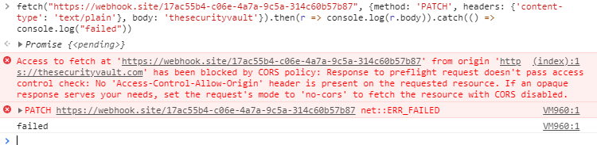
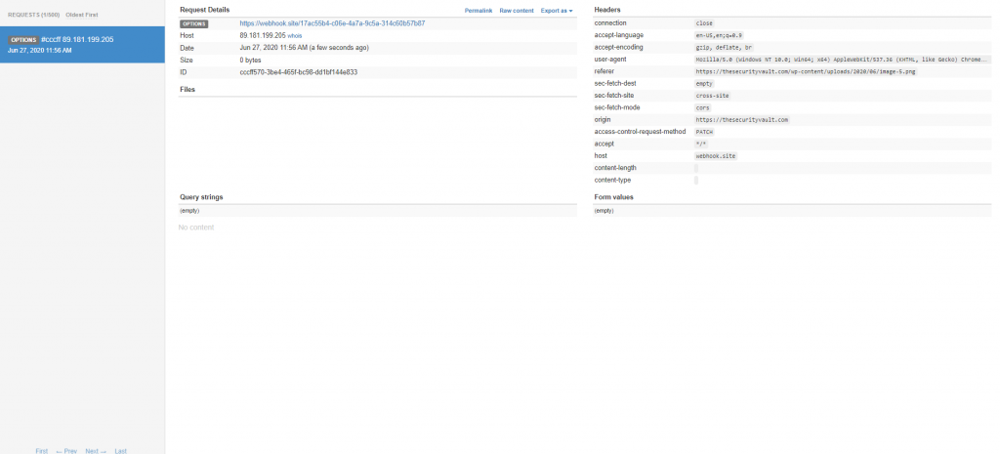
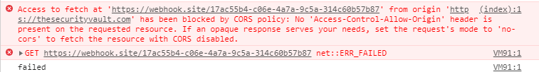
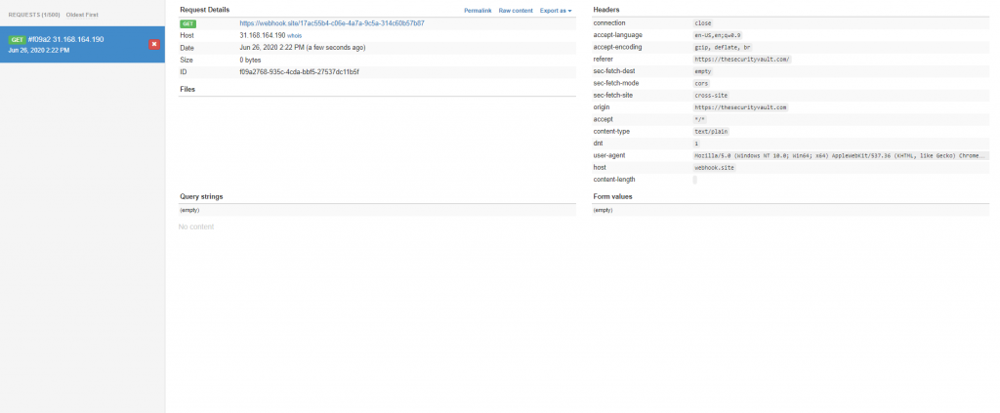
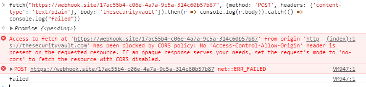
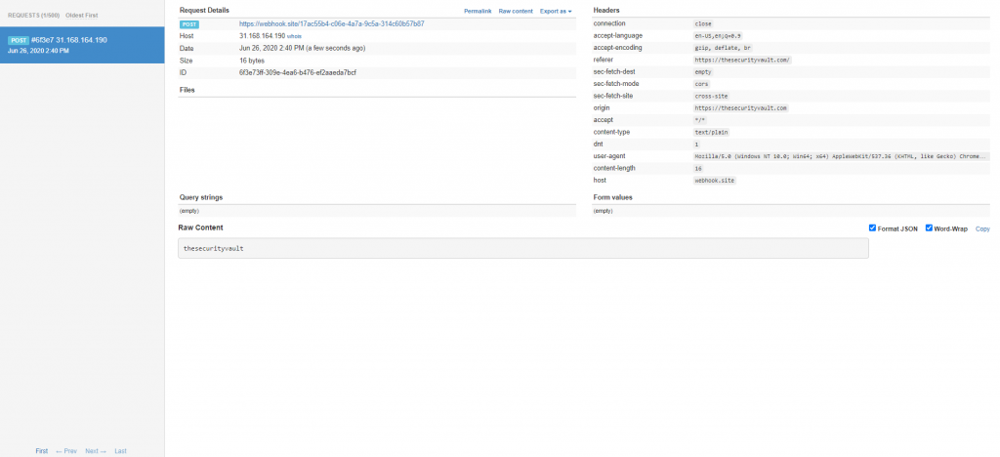

**CORS** which stands for Cross-Origin Resource Sharing is a system designed to help 'bypass' some of the restrictions introduced by [Same Origin Policy](https://developer.mozilla.org/en-US/docs/Web/Security/Same-origin_policy) (SOP prevents javascript code from interacting with resources from other origins).

Basically CORS lets us define a set of 'rules' to specify which resources can access responses from our server. By default no rule is defined, so SOP will only allow interactions form the same domain.

It is worth notice that SOP/CORS is applied basically for browser's javascript. This means that if you write an application in Java, or even Node, it shouldn't affect you in any way.

## What's the point of SOP and CORS?

SOP is a huge security mechanism that controls how a resource (like a webpage or scripts) interact with other resources. SOP prevents code from an iframe (loaded with some website's code) from accessing your webpage data, for example. It's an isolation mechanism.

CORS on the other hand was introduced to help bypassing this restrictions, as sometimes you may want these resources to comunicate between them.

## CORS Response Headers

As CORS works through some HTTP headers it's important to understand which the most common headers used. Lets take a look at some:

### Access-Control-Allow-Origin

This is the most important header as it specifies which origins can access the server resources:

Access-Control-Allow-Origin: <https://thesecurityvault.com>

If a server sends the header above, it will instruct the browser that it accepts Cross Origin requests from <https://thesecurityvault.com>

A wild card can be set, although not recommended

### Access-Control-Allow-Methods

Like the header above, this one instructs which method can be invoked

Access-Control-Allow-Methods: POST, GET, OPTIONS

In this case we are allowing other webpages to do POST, GET and OPTION requests to our server

### Access-Control-Allow-Headers

Specifies which headers can be sent.

Access-Control-Request-Headers: X-Some-Header

## CORS Preflight request

The preflight request is a request automatically sent by the browser to check if the server knows about CORS and if it allows the request.

This is where things start to get tricky, because not all requests trigger a preflight request.

To not trigger a preflight request this is what's needed:

- **Method:** The HTTP method needs to be a GET, POST or HEAD
- **Headers:** Besides the default headers automatically injected, only [CORS safe headers](https://fetch.spec.whatwg.org/#cors-safelisted-request-header) can be set.
- **Content Type:** Needs to be 'application/x-www-form-urlencoded', 'text/plain' or 'multipart/form-data'.
- **ReadableStram:** Do not open a ReadableStram in the request
- **No Listeners on** **XMLHttpRequestUpload**

Mozilla has an awesome [documentation](https://developer.mozilla.org/en-US/docs/Web/HTTP/CORS#Simple_requests) about this as well.

### Examples

Lets see some examples... I like to use [https://webhook.site](https://webhook.site/) to test requests. It's really nice and powerful.

Lets start by something that we know will trigger a preflight request:

```ts
fetch("https://webhook.site/17ac55b4-c06e-4a7a-9c5a-314c60b57b87", {method: 'PATCH', headers: {'content-type': 'text/plain'}, body: 'thesecurityvault'}).then(r => console.log(r.body)).catch(() => console.log("failed"))
```

[](images/image-6.png)

We have an error in the browser, but lets see in webhook:

[](images/image-7-1024x465.png)

We have an OPTIONS request, but no patch... so the method was blocked by CORS...

Now lets try with a request that will not trigger a preflight request:

```ts
fetch("https://webhook.site/17ac55b4-c06e-4a7a-9c5a-314c60b57b87", {method: 'GET', headers: {'content-type': 'text/plain'}}).then(r => console.log("done")).catch(() => console.log("failed"))
```

[](images/image.png)

As you can see, we had a CORS error, as the page at `https://webhook.site/17ac55b4-c06e-4a7a-9c5a-314c60b57b87` is not allowing CORS requests.

But lets see what heppens, at the webhook side:

[](images/image-1-1024x423.png)

As you can see webhook successfully received a GET request. No preflight, which according to the rules above makes sense. We sent an allowed method, an allowed content type, no extra headers...

Now if we try for example to set a POST with a body like:

```ts
fetch("https://webhook.site/17ac55b4-c06e-4a7a-9c5a-314c60b57b87", {method: 'POST', headers: {'content-type': 'text/plain'}, body: 'thesecurityvault'}).then(r => console.log(r.body)).catch(() => console.log("failed"))
```

[](images/image-2.png)

[](images/image-3-1024x468.png)

We still have the error in the browser, but the request keeps being made.

So what happens when no preflight is made is that the browser will only know how to comply with CORS policy when receives a response with the relevant headers, so the request is made anyway, but if a CORS policy is set it will only block the response...

SOP really helps out preventing some attacking techniques, like CSRF, but with the right conditions, as seen above it can be bypassed.

## HTML's Form tag

The preflight rules above may seem a little bit weird... Why doesn't a regular post request trigger a preflight request? Looks like a poor design...

In fact this has its logic underneath... and part of it is the <form> tag. If you look carefully for the rules to trigger the preflight you will notice that a form tag will never trigger a preflight, and it shouldn't, otherwise it would just brake a lot of websites.

So this may by a good attack vector for what we've seen above. Older websites are still heavily depending on forms, so most of those requests are being sent with 'application/x-www-form-urlencoded' which we already know that can be bypassed with fetch, or even with other form tags

## JSONP

JSONP (Json with Padding) is an old hack to bypass Some Origin Policy, from the time when we didn't have CORS. It basically consists on using a script tag to get some json data, with a prefixed method (the padding), which ends up being just javascript code

Basically a webpage would call a script like:

```html
 <script type="javascript" src="https://thesecurityvault.com/somedata?callback=processData"></script>
````

and notice the callback query param, that would be used by the server, to wrap the entire response data:

```js
processData({
  username: 'Luis Fontes',
  website: 'thesecurityvault.com'
})
```

This code would be injected into the webpage, calling the processData method.

This still works, but shouldn't be used, specially because JSONP can be a security risk, causing XSS or [Reflected File Download](https://www.trustwave.com/en-us/resources/blogs/spiderlabs-blog/reflected-file-download-a-new-web-attack-vector/)

## CORS Proxy

The easiest and faster way to bypass SOP when doing requests is by using a CORS proxy. This can basically inject the headers (seen above) in the responses allowing all types of requests from all origins.

There are some nice online CORS proxy tools like [https://corsproxy.github.io/](https://corsproxy.github.io/)

Using this services may raise some security concerns like is the proxy sniffing the data you send/receive from it?

Best approach to go with a CORS proxy would be to use an open source tool, and deploy it yourself.

You can also use [SharpCorsProxy](https://github.com/luisfontes19/SharpCorsProxy) which is an OpenSource project I did some time ago.

## Null Origin

Some times, developers tend to add 'null' as an allowed origin in CORS policy. This is to help on local developments as local pages usually have 'null' as origin. This is sometimes forgotten, and you can even see this config in production environments.

Getting a null origin is fairly easy, you can get it by having a local page, or just by doing a request inside an iframe.
