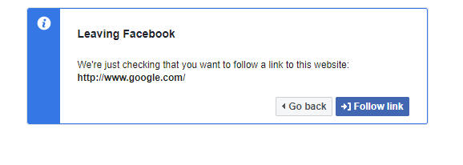
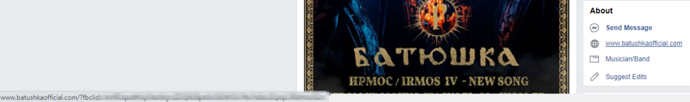
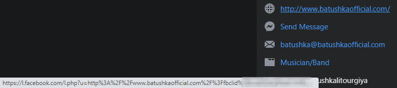
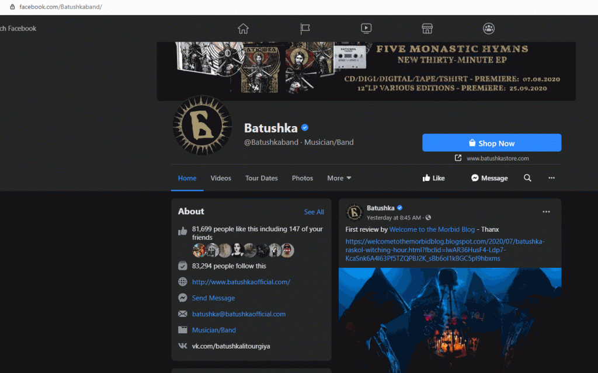

Some days ago I found an Open Redirect in Facebook website, that I promptly reported to their Bug Bounty Program. There were a lot of warnings that Open Redirect's are usually false positives, but this one looked legit to me.

Facebook disregarded the report, saying that wasn't exploitable as there are protections in place against it.

So this is a blog post of a "not" open redirect issue in Facebook.

### The Vulnerability

Before moving forward we need to understand what Open Redirect is.

Open Redirect happens when a website has a redirect page, that blindly redirects a user to a website provided. This with some social engineering can be used to trick a victim to go to a malicious website.

Lets see an example:

Assume example.com has an endpoint at /redirect that receives a "url" query parameter, that when hit, will redirect a user to the url provided:

<https://example.com/redirect?url=malicious.com>

An URL opened by the user would be automatically redirect him to malicious.com.

An inexperienced user looking at the URL would assume that he's opening example.com and click on it, but in fact its going to malicious.com

This is a simple url, but you can make the url much more complex and obfuscated to that the user doesn't notice whats happening:

<https://example.com?token=QSbCZSb05aCbOZo6Zxdr&%75%72%6c=%6d%61%6c%69%63%69%6f%75%73%2e%63%6f%6d>

This was done by adding a new param, which is ignored by the webpage, and [URL encoding](https://onlineasciitools.com/url-encode-ascii) the malicious.com website.

And not this becomes a more hard to understand URL, and can easily be used to trick a user.

### Protection

Easiest way to protect your website against open redirect attacks is by not automatically redirecting based on user input. In most of the times it is not needed.

If you really need to do it, there are a few ways of doing this.

The most common one is by showing a warning to the user before a redirect:

You can see this in action [here](https://l.facebook.com/l.php?u=https://google.com)

(We will see bellow another and nice way to protect against open redirect)

### Open Redirect and Facebook

Although the above message is displayed by facebook, sometimes this is not enough. In Facebook's case all URL's that you open are in fact a redirect done by  [facebook.com/l.php](https://www.facebook.com/notes/facebook-security/link-shim-protecting-the-people-who-use-facebook-from-malicious-urls/10150492832835766#) or [facebook.com/l/](https://www.facebook.com/notes/facebook-security/link-shim-protecting-the-people-who-use-facebook-from-malicious-urls/10150492832835766#)

Facebook uses this mechanism so that every time you open a new link, it goes through one of these two endpoints, so they can collect some data like the link you clicked and when. This can then be used for targeted ads for example.

Now you are probably asking why you never noticed you are being redirected to these endpoints... I also had never notice either until a few days, and this was due (probably) to a mistake with the new Facebook interface.

When I wrote this post facebook was in the process of migrating the website to a material like style. And in the old interface, every time you hovered a link this would be what you would get:

If you notice in the bottom left corner the url doesn't point to one of facebook's endpoints...

This is due to a feature that facebook implemented... On every link there's an onclick listener that will replace the current URL by one pointing to one of the facebook redirection endpoints.

BUT, with the migration to the new interface I finally noticed this as it is not in the onclick event (probably a bug):

#### Link Shims

But if every link is a redirect, and as seen above, facebooks warns when leaving the website, how come that we don't see the warning everytime we leave facebook?

This is due a nice feature facebook added, called Link Shims.

Acording to facebook's [documentation](https://www.facebook.com/notes/facebook-security/link-shim-protecting-the-people-who-use-facebook-from-malicious-urls/10150492832835766) every link when replaced in the onclick event is added a user specific token. This token makes sure that that link redirect is only to be used by the same user for whom the token was generated.

This way, if an attacker copies the url with the token and sends it to another user, it will be invalid and the user will be prompt before leaving facebook. Its a really nice trick.

But this is where things start to get complicated as this protection seems to not be working as expected.

#### The issue

As I mentioned before, and as is mentioned in the facebook's documentation the token generated should be user specific. This is the only way the token actually protects against Open Redirects.

Unfortunately this is not what is happening, and the token is not being properly validated, opening the website to the vulnerability.

To take advantage of this, an attacker can get the link generated for him, alter the redirecting website and just send it to his victim as in the GIF bellow

Take into consideration the the copy url only worked due to the change in facebook layout that exposed the redirect url. Otherwise you would need other ways to get it.

I tested this in multiple ways, to make sure it was actually exploitable and these are my findings:

- The token is not being validated properly. It worked for every facebook user I sent the manipulated links, and works even when not logged into facebook
- There's a blacklist of websites that facebook blocks automatic redirects, independently of the token, like [https://evilzone.org/](https://evilzone.org/)
- Although the blacklist, websites with invalid certificates (expired, revoked, untrusted, etc) are not blocked (I used [https://badssl.com/](https://badssl.com/) for the tests)
- Shortened URL's are first resolved to make sure they are not a blacklist URL
- If you remove the token, it will always warn you before the redirect
- The token is valid for about 3 hours and 15 minutes. After that facebook will also ask you if you want to be redirected. This may be bad for a phishing email campaign but still works awesome if in a chat conversation, a live event, etc.

#### Facebook's Response

At the time of this writing I've exchanged a few messages with facebook and they still refuse to accept the vulnerability as they are "protected" by the linkshims, blacklists, and time based tokens.

Independently of all of those protections open redirect is still possible, maybe not for phishing emails due to the time limitations but maybe for a phishing attack on social media, chats, live streams, etc...
