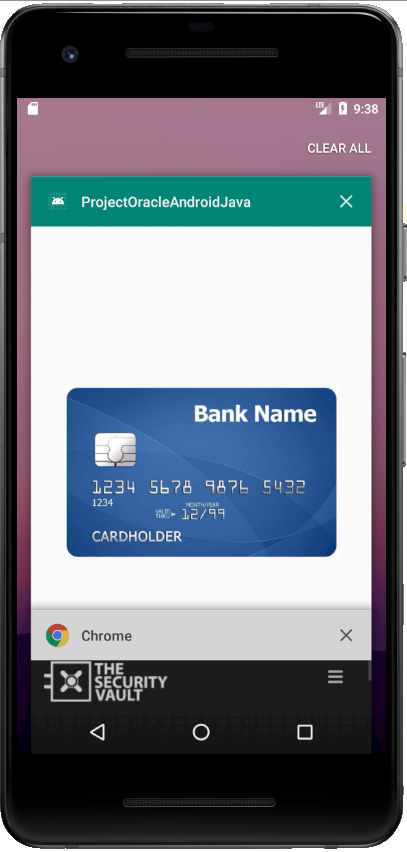
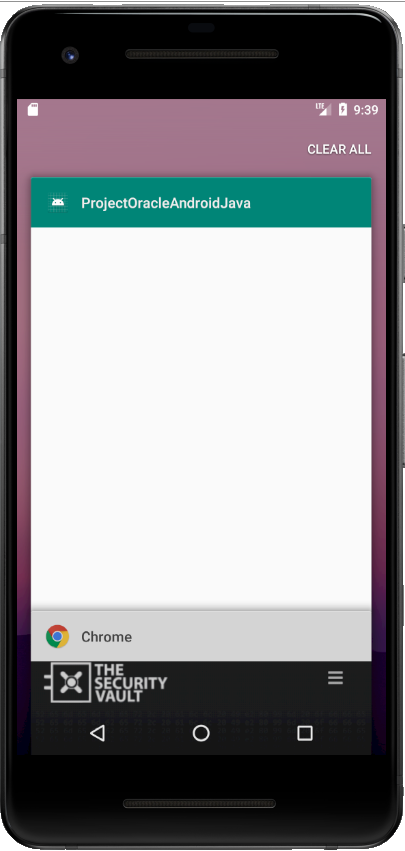
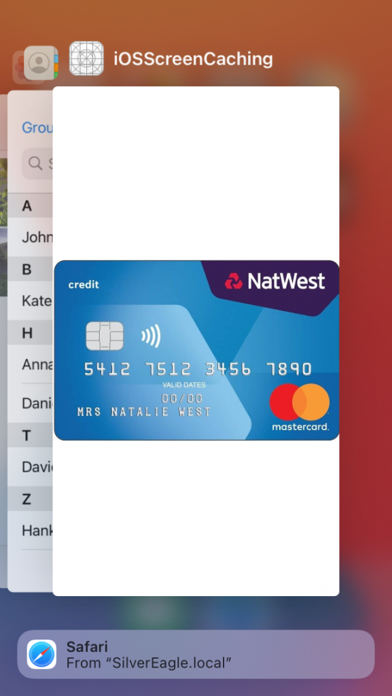
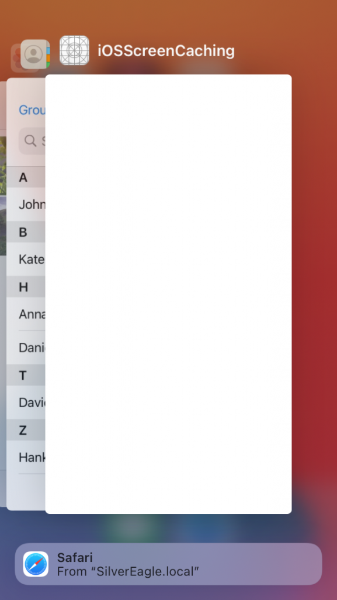

Screen Caching is another of those vulnerabilities nobody is paying attention to, and this one is quite important.

As an example, even most bank applications are usually 'vulnerable' to this issue (most of mine are). And this is a reality even for those focusing on security, like web based only banks.

### So what is screen caching?

Screen caching is a mobile vulnerability, caused due to a performance/usability feature present in mobile OS's.

Let's see an example, you're navigating in your bank account through the mobile app, then you send the application to background and go on with your life.

When you grab back your phone and eventually open the "Recent Apps" screen you'll see there the bank's application with the sensitive information like your bank account balance. This is specially bad if you are showing something to your friends on your phone, as they can easily see this private information.

[](images/image.png)

### How to Fix it

This is an intended behavior from iOS as well as Android, that take a snapshot of the application right before it is backgrounded, to be shown in the App Switcher (iOS) or "Recent App" screen (Android).

So a fix to this issue is to hide the important fields just before the app enters background.

There are a few ways to do this, but these are the 2 most common:

- Just before the app enters background open a new view. This is usually done with just the app logofor that. When the app is opened again, hide the screen
- Hide the fields with sensitive information when the application is being backgrounded. Revert the operation when opening back.

### Android

Android has native ways to add this protection, being the easiest one, showing a blank screen by specifying a [secure flag](https://developer.android.com/reference/android/view/WindowManager.LayoutParams.html#FLAG_SECURE)

This can be done by registering the relevant activities as secure in the onCreate method like so:

getWindow().setFlags(
   WindowManager.LayoutParams.FLAG_SECURE,
   WindowManager.LayoutParams.FLAG_SECURE
);


<a href="images/image.png">
  
</a>

<a href="images/image-1.png">
  
</a>
  </p>


### iOS

For iOS the easiest way to accomplish this is by using the methods 'sceneWillResignActive' and 'sceneDidBecomeActive' from AppDelegate/SceneDelegate.

```swift
import UIKit
import SwiftUI

class SceneDelegate: UIResponder, UIWindowSceneDelegate {

    var window: UIWindow?
    var screenCachingProtection: UIView!
    
    func scene(_ scene: UIScene, willConnectTo session: UISceneSession, options connectionOptions: UIScene.ConnectionOptions) {
        let contentView = ContentView()

        if let windowScene = scene as? UIWindowScene {
            let window = UIWindow(windowScene: windowScene)
            window.rootViewController = UIHostingController(rootView: contentView)
            self.window = window
            window.makeKeyAndVisible()
            
            self.screenCachingProtection = UIView.init(frame: window.frame )
            self.screenCachingProtection?.backgroundColor = UIColor.white
        }
    }

    func sceneDidDisconnect(_ scene: UIScene) {}

    func sceneDidBecomeActive(_ scene: UIScene) {
        self.screenCachingProtection?.removeFromSuperview()
    }

    func sceneWillResignActive(_ scene: UIScene) {
        self.window?.addSubview(self.screenCachingProtection!)
    }

    func sceneWillEnterForeground(_ scene: UIScene) {}

    func sceneDidEnterBackground(_ scene: UIScene) {}

}
````


<a href="images/simulator_screenshot_2F890BB3-2362-4CAA-BDA8-BDC8DF7CB1D3-577x1024.png">
  
</a>

<a href="images/simulator_screenshot_99C2BF54-5484-4249-B58A-48F49809503F-577x1024.png">
  
</a>
  </p>


You can use this as well to show a splash screen or something similar.

This code only works for UIKit App Delegate's App lifecycle. If you chose to manage the app lifecycle with SwiftUI I'll update this post with the code for that in the future

Another nice trick for iOS is to blur the background. There's a nice comment on [StackOverflow](https://stackoverflow.com/a/53503787) for that.
