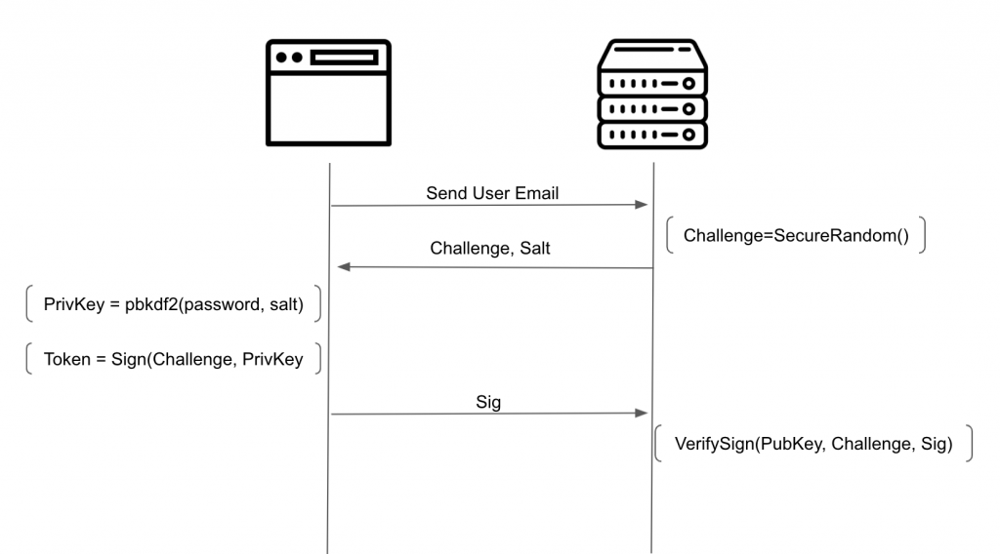

For a long time I've been struggling with the way authentication systems work, as they don't protect your password as they should. If you search for login best practices, like in [OWASP](https://cheatsheetseries.owasp.org/cheatsheets/Authentication_Cheat_Sheet.html), they'll tell you things like hashing the password with a strong algorithm, use salt and pepper, limit attempts, and the most important, use https.

## The Issue

Although all of this is true and should be done, all of this has a huge fail: **Users need to trust their password to the server**. In this common flow, the user needs to send the password to the server, and trust that the server will take good care of it. But saving it in the database its not all. In 2019 [facebook found millions of passwords being written in plaintext to the logs](https://www.theverge.com/2019/3/21/18275837/facebook-plain-text-password-storage-hundreds-millions-users) for example. But even besides that, the server hashes and stores a protected version of the password in the DB, but what else can the server do with the unprotected version of the password?

Users tend to [reuse passwords](https://services.google.com/fh/files/blogs/google_security_infographic.pdf), and yes this is a (really) bad practice, but most of users still do it, either because its easy, or just because they have no idea how bad that can be. What if the server has bad intentions and uses your plaintext password and your supplied username/email to try to get access to other services that use the same credentials? But most important, passwords are private so why should we need to trust them to the servers we are authenticating to?

## SSO to the rescue?

Using single sign-on systems can somehow reduce this risk, as you only need to trust your password to the SSO system, and all platforms that implement the SSO will never get your password. This works somehow but in a lot of the cases you still need to trust your password to the SSO server

## Password-less Approaches

There are password-less alternatives but they usually require you to have some kind of specific hardware, which most of the times needs to be acquired separately, so asking a user to buy a device to be able to login into your application is not reliable, although it works.

There are other approaches like emails with "magic-links" (for example slack), QR code scanning with a logged in app in the phone (web based whatsapp). Which work ok as well, but at least for me, these are more suitable for 2FA's.

## Other alternatives

There are a few ways to create a trustless system to deal with the authentication in a secure way, without receiving the user password. Lets see a few:

### ECC

This is the flow that I created for some of my cases

Elliptic curve cryptography. Asymmetric encryption is always a good solution as you have the private key in your side and a public key that can be stored in the server without need to worry. Unfortunately typing a private key on a website to login is not practical at all. That's where ecc comes into play.

You can create a private key from basically any 32 byte sequence, and from there derive a public key. This can make our asymmetric approach feasible.

The next image demonstrates the flow needed to implement this solution

In this solution as you can see, we create a private key based on the user password. At signup the public key is sent to the server and the server generates a secure salt for the PBKDF2 function.

So every time the user wants to login the password is used to recalculate the private key based on the user password, and that private key is used to sign a unique challenge securely generated on the server. The user never sends his password to the server, and the server only stores a public key, which as the name suggests, is public.

If you want to go the extra mile you can also generate a nonce in the frontend, and mix it in the signing method like `Sig = Sign(Challenge+Nonce, PrivKey)`. Both the Nonce and the Sig need be sent to the server. This way the user can enforce that a really random value is added (not trusting the Challenge).

### Double Hashing

Another solution is to double hash the password, once in the frontend and once in the backend. This way, when the password gets to the server is already an "unreversible" hash. We need to hash it again because if the hashes from the database are dumped an attacker just needs to send the hash as is to be able to login (would be like if it was as plaintext). Hashing again in the backend invalidates this vector.

Going with this approach needs to create two salts, one for each hashing.

### Secure Remote Password (SRP)

[SRP](https://datatracker.ietf.org/doc/html/rfc2945) is a really interesting proposal already being deployed by big players, which consists on generating and sending to the server a verifier with which the server can check that the user knows the actual password, without sending it. On top of that is possible to derive a shared secret key on both sides, without ever sending it over the network, just like [Diffie Helmen](https://en.wikipedia.org/wiki/Diffie%E2%80%93Hellman_key_exchange). [This](https://github.com/mozilla/node-srp) implementation's docs do a great job explaining the logic
