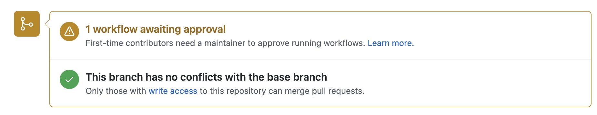
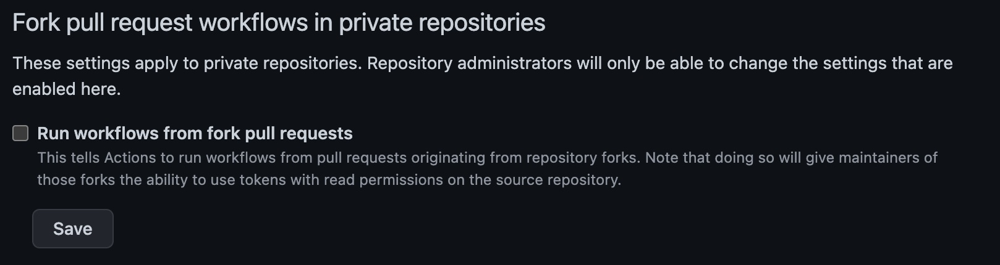
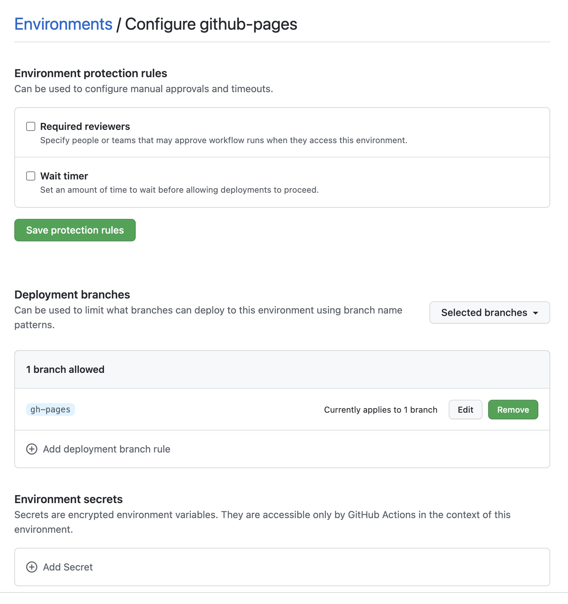
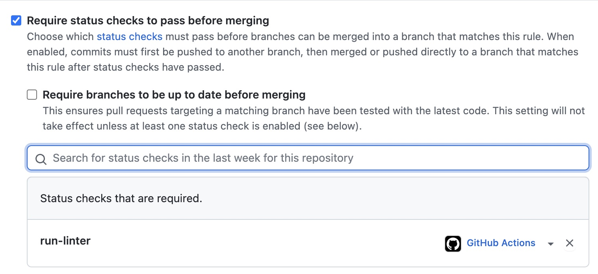

Github actions are a thing more and more common nowadays, and I have to admit, I love them. But the security of Github Actions are usually ignored. In this post I'll go through some of common flows and issues, and see some preventions

## Terminology

First its important to understand the terminologies used as the naming convention chosen by github may be misleading.

* **Github Actions** is the name for the feature
* A **Step** is a small set of operations in a job. A step can be for example calling an action, or running bash code.
* An **Action** is a set of steps combined to do an operation. An action is the smallest reusable block, that can be exported and invoked from other jobs.
* A **Job** is a set of steps and actions, that you can define to run on a specific environment
* Finally, a **workflow** is a set of jobs, represented in a yml file that trigger on a specified event.

## Github Actions overview

Github Actions are an awesome way of creating CI/CD pipelines on github. Developers can easily create .yml files to configure workflows and perform common tasks like running tests or create builds.

You can use also use javascript (and other languages) to create a more complex Action.

Github Actions are used to deploy code, run tests, run SAST scans, run linters, create final product builds, block the pipelines for approvals, and basically anything that you can remember.

Let's see some of the possible security issues with Github Actions

## Possible issues

1. [Secrets Leak](#secrets-leak)
2. [Workflow manipulation](#workflow-manipulation)
3. [Workflow with write permissions](#workflow-with-write-permissions)
4. [Third-Party Actions abuse](#third-party-action-abuse)
5. [Pull Request Review Bypass](#pull-request-review-bypass)
6. [Custom Runners](#custom-runners)
7. [Billing Issues](#billing)
8. [Do you need an Action for that?](#do-you-need-an-action-for-that)
9. [Required status checks to pass](#required-status-checks-to-pass)

### Secrets Leak

Using the secrets feature may give you a false sense of security.

Although github does some filtering on the workflow output to prevent secrets from being leaked, this routine is basically a simple search and replace. Secrets can still be printed to the workflow log if you base64 encode it for example, or if you reverse the string, or if you print one char at a time (and many other ways).

Having this chained with [Workflow Manipulation](#workflow-manipulation) and you get a serious thing.

This does not impact only public repos, but also private organizational repositories with global secrets configured.

### Workflow Manipulation

There are multiple ways developers can change a workflow. For example, in an organization users can edit the actions of any repo they have write access to.

The scary thing about it is that if you add/change a workflow in your branch and the right conditions are met for the action to be [triggered](https://docs.github.com/en/actions/using-workflows/events-that-trigger-workflows) it will trigger the changed workflow from your branch and not the one on the default branch or de previous one before your commits.

On public repositories that's also tricky.

If a developer does a fork of your project the workflows running on his fork won't use any of your secrets, and they can even fail until the developer configures the secrets in his fork.

But if he does a Pull Request things change a bit.

By default, github only requires an approval for first time contributors to the repo. This means that a workflow run needs to be manually approved for new contributors.



But after the first contribution (a PR to be merged) the developer can run the workflows automatically, which means he can change the code to dump secrets for example, do the PR and it will run.

If you have linters or sast tools that you want to run before merging PR's this can be problematic.

There are malicious users that do simple PR's to fix typos or formatting issues on open source repos so that the owners of the repo approve them to run the workflow. After that he is free to run the workflows as he wants to.

To secure yourself from this, consider one of the options:

1. Configure workflows to need manually approval for all runs ([docs](https://docs.github.com/en/actions/managing-workflow-runs/approving-workflow-runs-from-public-forks))
2. Allow any user to run any action but the ones that need sensitive fields make them manually triggered, passing the sensitive information as param inputs.
3. [Configure environments](#environments)

If you're running workflows under an organization you have an org wide setting to disable workflows to run from pull requests from forked repos. This helps preventing repo specific secrets from getting leaked tby other organization members that do not have write permissions to the repository.



Tip: You can also disable forks from organization's repositories.

### Workflow with write permissions

When running a workflow, github generates a temporary token (GITHUB_TOKEN) that lives only for the time of the running of the workflow. This token has by default read and write permissions to the repository and can be accessed by any action/step.

So, if you use *random* actions from the [Github Marketplace](https://github.com/marketplace?type=actions) the actions also have access to this token so be careful.

You should restrict the permissions of the GITHUB_TOKEN, in case you don't need writing permissions. ([docs](https://docs.github.com/en/actions/security-guides/automatic-token-authentication#modifying-the-permissions-for-the-github_token))

#### Environments

Github environments can also contain secrets, and jobs that use environments need first to pass all protections to run. This means that environment secrets are only exposed after passing these protections.



You can require people to approve a workflow to run, and only make it run after X hours, which can add some time for relevant people see if something is wrong.

Also, you can restrict which branches can trigger the environment, so if you have a strict master branch protection, where it can only be merged by pull request (no direct pushes), and x reviewers, you can restrict an environment to run on master for example, which adds a good extra security.

### Third-Party Action abuse

Good news. 3rd party actions cannot access your secrets variable... But they can access the GITHUB_TOKEN.

Good safety preventions for this are to set the GITHUB_TOKEN has as [ready only](#workflow-with-write-permissions) and to [specify which specific permissions](https://github.blog/changelog/2021-04-20-github-actions-control-permissions-for-github_token/) the workflow will have when running.

Remember that when you use 3rd party actions on most of the cases they will have access to you code as you probably did a checkout before, and even if you didn't the action can do it with the GITHUB_TOKEN. If you have a private repo a malicious extension can easily exfiltrate your code.

Nowadays there's a trendy term for this: **Supply Chain Attack**

To prevent malicious abuse of the 3rd party actions review the code of the action in the marketplace, and hardcode the hash of the commit reviewed, when using the action on your workflow.

Otherwise an action author can release a new malicious update or delete a specific version and push the same version tag with different code. Using commit hashes prevents possible issues on your side.

Ex:

```yaml
...
steps:
  - name: "Checkout code"
    uses: actions/checkout@ec3a7ce113134d7a93b817d10a8272cb61118579 # v2.4.0
...
```

Also, github provides a configuration to specify which kind of actions can be run in an org/repo.

You can choose to disable Github Actions, to allow any action to run, local actions only (from the same org or the same repo) or even go into more detail and specify action names or even commit hashes

### Pull Request Review Bypass

Another interesting attack vector is by using the GITHUB_TOKEN to approve a PR. Since this token does not represent the user that trigger the event, using the token to approve a PR will just work.

If you only need 1 (more) approval to merge a PR, then you can easily do it with this flow. You can read more about this vulnerability in the eyes of the researchers who found it, [here](https://medium.com/cider-sec/bypassing-required-reviews-using-github-actions-6e1b29135cc7)

Meanwhile github added a new setting to help preventing this issue for organizations:


This setting is enabled by default in new repos, but repos created before the feature was introduced have it disabled.

Some other recommendations online for this issue, is to increase the number of reviewers, but depending on your settings this may not be enough. For example if you don't need a new approval after a code change, when you get number_of_required_approvals - 1 you can change the pull request and the action to approve it.

So for that recommendation to work, you need to enable the option "Dismiss stale pull request approvals when new commits are pushed" on the branch protection rules:


And as a precaution add at least 3 reviewers instead of 2. So that you have at least two real reviewers.

### Custom Runners

Workflows run in Runners. A runner is a container, and you can chose from a few different ones, being the most common ubuntu.

A lot of organizations use custom runners, inside AWS for example, with privileged accesses to organization assets. This is done for example to do deployments.

The issue with this is as we saw before in [Workflow Manipulation](#workflow-manipulation) if somebody changes the action they have privilege access to everything the runner has as well.

On a private repo, as a rule of thumb do not use custom runners with more access then the users on that repo

### Billing

Github actions are not free. For each different plan, github offers an amount of minutes and space for workflows. When that time or space comes to an end new costs are billed. This can be exploited to make workflows run for big amounts of time and a lot of times and eventually to increase the billing.

Check the storage and minutes for each plan [here](https://docs.github.com/en/billing/managing-billing-for-github-actions/about-billing-for-github-actions)

### Do you need an Action for that?

As said before Github Actions are trending right now, which makes people overusing them. Having that in mind the first thing you should do before creating an action/workflow is to ask: "Do I really need that in Github Actions?"

Sometimes the best solution is not using an Action, like when deploying a product on a cloud service (like AWS), since you need to store credentials on Github, which as seen before can be an issue.

Also, if you are storing AWS credentials for you production systems you are adding another point of failure in your chain. You are trusting github with access to your systems, which you should not do. For something like that a webhook is preferred, security wise.

Lets see another example.

[TheSecurityVault.com](https://TheSecurityVault.com) website was just migrated from a [Wordpress](https://wordpress.com/) platform to a static generated website with [Hugo](https://gohugo.io/).

The website code is hosted in github, and there's a workflow that does the build and deployment.

But one important thing was to have a flow that removes [Exif](https://en.wikipedia.org/wiki/Exif) metadata from the images on the website. A first plan can be to use for example [exiftool](https://www.exiftool.org/) on a github workflow. But if you think carefully about it, if thats done on a workflow in means that the information has already been commited to git...

Instead I created a [pre-commit hook](https://git-scm.com/book/en/v2/Customizing-Git-Git-Hooks) that removes that metadata before even commiting to Git

Another example is markdown linting. Since the website is now written basically in markdown its important to keep it organize. I use markdownlint to do that.

I could have an action that runs markdownlint and fails if there are issues, which would force me to do an extra commit and push, or fix it on the fly, which would require an extra commit.

A better approach is again to use a pre-commit hook that runs markdownlint (and fixes the issues). Still there's an action on github that just checks markdownlint as a fallback, just to make sure. But relying just on the action may not be best approach.

### Required status checks to pass

Branch protections have an option to require status checks to pass before merging PR's. This means that the workflows need to successfully pass first.



Repository/Organization admins may rely on this feature to try to add some security, trying to force workflows to succeed on some checks, before merging. But this gives a false sense of security. As we saw before in [Workflow Manipulation](#workflow-manipulation) a developer can change the workflow to always pass, bypassing then this configuration.

A workaround for this is to force multiple approvals (I recommend 2 if github actions [cannot approve PR's](#pull-request-review-bypass)). This way, although the user changes the workflow to pass the checks, the reviewers of the pull request will see the change in the workflow and can reject the PR.

## Key Takeaways

* Github actions are trending now, but do you really need a workflow? Is it the best option for you need?
* Secrets can be accessed by anybody with write access to a repo
* Secrets can be accessed by external repo users
  * By default, developers can run actions at will after first contribution, change the setting to always need manual approval (if you have secrets or privileged flows)
  * Are you doing a deployment? Use a webhook instead to trigger a flow in a more restricted environment, or configure restricted github environments
* Avoid organization's wide secrets, anybody with permissions to create/write to a repo can extract them
* Avoid 3rd party action. You can enable options to only allow github's, verified  or internal actions to run.
* When using external actions review the source code first, and pin them to a specific commit hash to make sure there were no changes.
* Limit the workflow permissions
* Remove default GITHUB_TOKEN write permissions if not needed
* Block actions from approving pull requests on older repos
* Do not make available custom runners that have access to more things then the developers
* Change "Fork pull request workflows from outside collaborators" to "Require approval for all outside collaborators" for public or sensitive repos if you have configured secrets
* Do not rely on "Require status checks to pass before merging" if developers can change the actions
* Disable the permission for github actions to approve PR's
* Use at least 2 reviewers for PR's and block push to master

## Other docs

If you are writing github actions, i'll leave here some documentation pages that were very helpful to me:

* [Workflow Triggers](https://docs.github.com/en/actions/using-workflows/events-that-trigger-workflows) - Events that can trigger a workflow
* [Env Variables](https://docs.github.com/en/actions/learn-github-actions/environment-variables) - Environment variables available when running bash
* [Contexts](https://docs.github.com/en/actions/learn-github-actions/contexts) - The context structure and all fields
* [Expressions](https://docs.github.com/en/actions/learn-github-actions/expressions) - Expressions to use in the yaml file like operators and functions
* [Github Script](https://github.com/actions/github-script) - Run inline javascript code in the the yaml file
* [Upload artifact](https://github.com/actions/upload-artifact) - Action to upload artifacts generated in the workflow
* [CodeQL Action](https://github.com/github/codeql-action) - CodeQL Action and Sarif uploads
