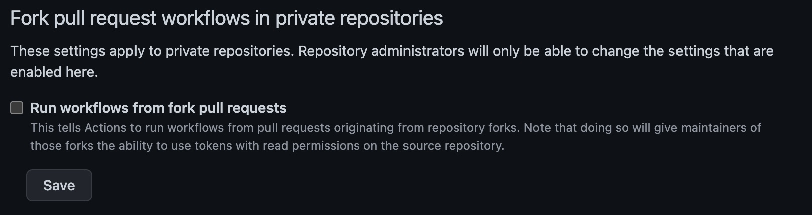

Github actions are a thing more and more common nowadays, and I have to admin, I love them. But but the security of Github Actions are usually ignored. In this post I'll go through some of common flows and issues, and see some preventions

## Terminology

First its important to understand the terminologies used as the naming convention chosen by github may be misleading.

* **Github Actions** is the name for the feature
* A **Step** is a small set of operations in a job. A step can be for example calling an action, or running bash code.
* An **Action** is a set of steps combined to do an operation. An action is the smallest reusable block, that can be exported and invoked from other jobs.
* A **Job** is a set of steps and actions (all optional), that you can define to run on a specific environment
* Finally, a **workflow** is a set of jobs, represented in a yml file that trigger on a specified event.

## Github Actions overview

Github Actions are an awesome way of creating CI/CD pipelines on github. Developers can easily create .yml files to configure workflows and perform common tasks like running tests or build processes.

You can use also use javascript (and other languages) to create a more complex Action.

Github Actions are used to deploy code, run tests, run SAST scans, run linters, create final product builds, block the pipelines for approvals, and basically anything that you can remember.

Let's see some of the possible security issues with Github Actions:

1. Workflow manipulation
2. Workflow with write permissions
3. Secrets Leak
4. Third-Party Actions abuse
5. Pull Request Review Bypass
6. Custom Runners
7. Billing Issues

## Possible issues

### Workflow Manipulation

There are multiple ways developers can change a workflow. For example, in an organization users can edit the actions of any repo they have write access to.

The scary thing about it is that if you add/change a workflow in your branch and the right conditions are met for the action to be [triggered](https://docs.github.com/en/actions/using-workflows/events-that-trigger-workflows) it will trigger the changed workflow from your branch and not the one on the default branch.

On public repos thats also tricky. Common things to run in workflows are linters and some kind of SAST tools.

If a developer does a fork of your project the workflows running on his fork won't use any of your secrets, and they can even fail until the developer configures the secrets in his fork.

But if he does a Pull Request things change a bit.

By default, github only requires an approval for first time contributors to the repo. This means that a workflow run needs to be manually approved for new contributors.

But after the first approval the developer can run the workflows automatically, which means he can change the code to dump secrets for example, do the PR and it will run.

There are malicious users that do simple PR's to fix typos or formatting issues on open source repos so that the owners of the repo approve them to run the workflow. After that we is free to run the workflows as he wants to.

To secure yourself from this, consider one of the options:

1. If you want workflows to run on all PR's like for linting/scanning do not use any kind of secrets in the repository. Instead you can have a webhook to an external service that uses the secrets. This way an attacker has low control on that. It can only trigger the process.
2. Configure workflows to need manually approval for all runs ([docs](https://docs.github.com/en/actions/managing-workflow-runs/approving-workflow-runs-from-public-forks))
3. Allow any user to run any action but the ones that need sensitive fields make them manually triggered, passing the sensitive information as param inputs.

If you're running workflows under an organization you have an org wide setting to disable workflows to run from pull requests from fork repos. This helps preventing repo specific secrets to get leaked to other organization members that do not have write permissions to the repository.



You can also disable forks from organization's repositories.

### Workflow with write permissions

When running a workflow, github generates a temporary token (GITHUB_TOKEN) that leaves only for the time of the running of the workflow. This token has by default read and write permissions to the repository and can be accessed by any action/step.

So, if you use *random* actions from the [Github Marketplace](https://github.com/marketplace?type=actions) they have access to this token as well, be careful.

This in public repos can have a bigger impact.

You should restrict the permissions of the GITHUB_TOKEN, in case you don't need writing permissions. ([docs](https://docs.github.com/en/actions/security-guides/automatic-token-authentication#modifying-the-permissions-for-the-github_token))

### Secrets Leak

Using the secrets feature may give you a false sense of security.

Although github does some filtering on the workflow output to prevent secrets from being leaked, this routine is basically a simple search and replace. Secrets can still be printed to the workflow log if you base64 encode it for example, or if you reverse the string, or if you print one char at a time (and many other ways).

Having this chained with [Workflow Manipulation](#workflow-manipulation) and you get a serious thing.

This does not impact only public repos, but also private organizational repositories with global secrets configured.

**Key takeaways for this section:**

* Secrets can be obtained by anybody with write access to the repository
* Avoid using secrets in actions in shared or public repositories
* Instead use webhooks to trigger flows outside of github, where you can securely store the secrets
* Only use organizational secrets if you are comfortable that anybody with access to the github org has access to the secret

### Third-Party Action abuse

Here's a good news. 3rd party actions cannot access your secrets variables... But they can access the GITHUB_TOKEN.

Good safety preventions for this are to set the GITHUB_TOKEN has as [ready only](#workflow-with-write-permissions) and to [specify which specific permissions](https://github.blog/changelog/2021-04-20-github-actions-control-permissions-for-github_token/) the workflow will have when running

Remember that when you use 3rd party actions on most of the cases they will have access to you code as you probably did a checkout before. If you have a private repo a malicious extension can exfiltrate your code.

To prevent malicious abuse of the 3rd party actions review the code of the action in the marketplace, and hardcode the hash of the commit reviewed, when using the action on your workflow.

Otherwise an action author can delete a specific version a push the same version with different code. Using commit hashes prevents possible issues on your side.

Ex:

```yaml
...
steps:
  - name: "Checkout code"
    uses: actions/checkout@ec3a7ce113134d7a93b817d10a8272cb61118579 # v2.4.0
...
```

### Pull Request Review Bypass

Another interesting attack vector is by using the GITHUB_TOKEN to approve a PR. Since this token does not represent the user that trigger the event, using the token to approve a PR will just work.

If you only need 1 (more) approval to merge a PR, then you can easily do it with this flow. You can read more about this vulnerability in the eyes of the researchers who found it, [here](https://medium.com/cider-sec/bypassing-required-reviews-using-github-actions-6e1b29135cc7)

Meanwhile github added a new setting to help preventing this issue for organizations:


This setting is enabled by default in new repos, but repos created before the feature was introduced have it disabled.

Some other recommendations online for this issue, is to increase the number of reviewers, but depending on your settings this may not be enough. For example if you don't need a new approval after a code change, when you get number_of_required_approvals - 1 you can change the pull request and the action to approve it.

So for that recommendation to work, you need to enable the option "Dismiss stale pull request approvals when new commits are pushed" on the branch protection rules:


And as a precaution add at least 3 reviewers instead of 2. So that you have at least two real reviewers.

### Custom Runners

Workflows run in Runners. A runner is a container, and you can chose from a few different ones, being the most common ubuntu.

A lot of organisations use custom runners, inside AWS for example, with privileged accesses to organization assets. This is done for example to do deployments.

The issue with this is as we saw before in [Workflow Manipulation](#workflow-manipulation) if somebody changes the action they have privilege access to everything the runner has as well.

On a private repo, as a rule of thumb do not use custom runners with more access then the users on that repo

### Billing

Github actions are not free. For each different plan, github offers an amount of minutes and space for workflows. When that time or space comes to an end new costs are billed. This can be exploited to make workflows run for big amounts of time and a lot of times and eventually to increase the billing.

Check the storage and minutes for each plan [here](https://docs.github.com/en/billing/managing-billing-for-github-actions/about-billing-for-github-actions)

## TL;DR

* Github actions are trending now, but do you really need a workflow? Is it the best option for you need?
* Secrets can be accessed by anybody with write access to a repo
* Secrets can be accessed by external repo users
  * By default contributors can run actions at will after first approval, change the setting to always need manual approval (if you have secrets)
  * Are you doing a deployment? Use a webhook instead to trigger a flow in a more restricted environment
* Avoid organization wide secrets, anybody with permissions to create a repo can extract them
* Avoid 3rd party action. You can enable a setting to only allow github and verified actions to run. Even better control allow only internal actions
* Limit the workflow permissions
* When using external actions review the source code first, and pin them to a specific commit hash to make sure there were no changes.
* Remove default GITHUB_TOKEN write permissions if not needed
* Block actions from approving pull requests on older repos
* Do not make available custom runners that have access to more things that the developers that can control the workflow with the action

If you are writing github actions, i'll leave here some documentation pages that were very helpful to me:

* [Workflow Triggers](https://docs.github.com/en/actions/using-workflows/events-that-trigger-workflows) - Events that can trigger a workflow
* [Env Variables](https://docs.github.com/en/actions/learn-github-actions/environment-variables) - Environment variables available when running bash
* [Contexts](https://docs.github.com/en/actions/learn-github-actions/contexts) - The context structure and all fields
* [Expressions](https://docs.github.com/en/actions/learn-github-actions/expressions) - Expressions to use in the yaml file like operators and functions
* [Github Script](https://github.com/actions/github-script) - Run inline javascript code in the the yaml file
* [Upload artifact](https://github.com/actions/upload-artifact) - Action to upload artifacts generated in the workflow
* [CodeQL Action](https://github.com/github/codeql-action) - CodeQL Action and Sarif uploads
