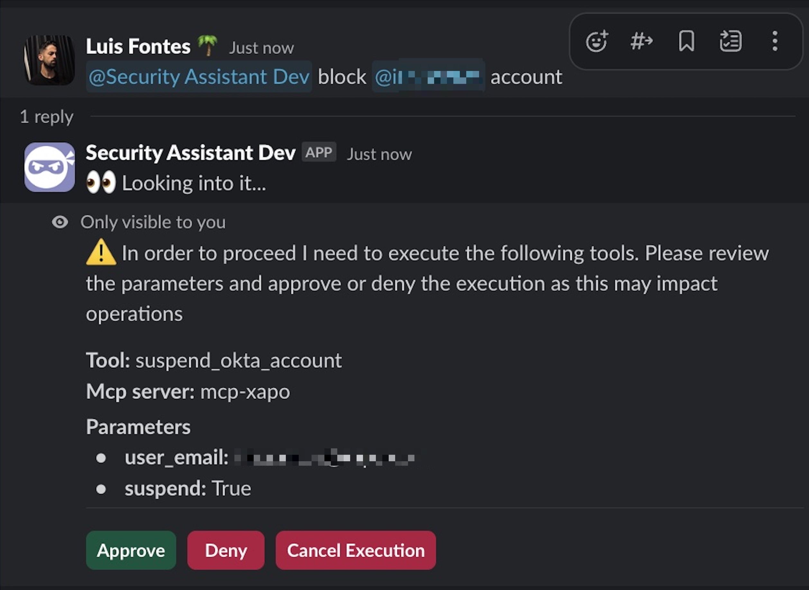

Let’s face it—security engineers spend way too much time doing repetitive support work: answering the same questions, triaging issues, nudging people through processes. What if we could delegate all that to a friendly assistant who *never gets tired*?

Well, I just built that. A helpful, AI powered Slack assistant (AKA Security Assistant) that handles all the boring, but necessary stuff. Here’s how we did it, what I learned, and how I kept it safe.

---

## 🛠️ Meet the Stack

Slack is already one of most used tools in the workplace, so placing the assistant there was a no-brainer. Everyone’s already chatting, asking questions and help so no new tools, no training wheels.

For compute, AWS Lambdas was the chosen option. Why? They’re simple, cheap, and perfect for lightweight automation. Whether it’s sending a message or running a small script, Lambdas let me focus on *what* I'm building, not *where* it runs.

The MVP was a simple Slack bot focused on Q&A. I fed it a system prompt explaining how our internal processes work, things like repo provisioning, WAF policies, vulnerability handling, etc.

It worked… kind of. It answered general questions fine, but anything specific to company use cases was completely off.

---

## 🧰 Supercharging with Tools

To give the assistant real power, I added tools, basically pieces of code it can use to get things done. Some examples:

- 🚫 Block an Okta account
- 🔓 Add an IP to the firewall allowlist
- 🚨 Spin up a security incident
- 📚 Read playbooks and internal docs
- Etc

With these tools, the assistant can now *do* things, not just talk. But to stay safe, it never runs tools on its own. All tool executions require human confirmation implemented into the backend logic, not the model. That means no 20 roll persuasion prompt can trick it into doing something shady.

Still, I ran into some problems:

- 🤖 Hallucinations! Even with more context, the assistant kept guessing, and wrong.
- 🔧 Tool management: Too many tools scattered across environments and platforms made them hard to integrate
- 📝 Tool confirmation on slack (with AWS Lambdas) overcomplicated what should be an easy flow, making it fail a few times

---

## 🔌 Enter MCP: The Model Context Protocol

MCP is an open standard that tells the assistant where to find tools, resources, and instructions and how to use them. Think of it like giving your assistant a GPS, toolbox, and manual all at once.

I built internal MCP servers and migrated our tools there to make the assistant the cool kid on the block and ready for what the future holds.
Better yet, I exposed the MCP client features into Slack, so through the assistant we can now see exactly what it is available to it and how it works while still keeping tight authorization in place.



---

## 🧠 Context Is King

The smarter the input, the smarter the bot so this is constantly being improved. For now some of they key aspects provided to the bot are:

- 📘 A detailed prompt on what is expected and how to behave
- 🛠️ A rundown of our internal tools and playbooks
- 📂 Read access to Jira projects and Confluence pages
- 🧾 Rules on how to reply and format answers
- ⚙️ Company specific processes and policies

The assistant can now search Confluence and Jira as needed, read the docs, and try again. That’s huge. It means it doesn’t rely solely on prompt knowledge, which gets outdated fast.

Also added cross system user mapping. If you tag a Slack user, the assistant can figure out their Okta ID, GitHub handle, or email. Handy when tools need a specific ID to run.

---

## 🔒 Security Matters

Repeat after me:
> LLMs should not handle security enforcements

Why? Because they can be tricked. Instead, we enforce auth the old fashioned way: in code.

The bot can only be used by small group of engineers in the security team and every tool execution gets a confirmation prompt showing the tool, parameters, and MCP server involved. The user gives the final go ahead or not.

Also, to reduce risk, all MCP servers being used were developed internally and run locally. No calls to other servers, no surprise behavior.

---

## 🧑‍💻 How We Use It

Today, you as a security engineer just @ the assistant in Slack to get help. Whether it’s answering a question, running processes, or helping during a security incident, the assistant’s there.

If it can’t do something directly, it may walk you through it based on the provided playbook. It’s a process coordinator, knowledge base, and tool runner, all in one.

---

## 🚀 Wrapping Up

Thanks to this assistant, a bunch of time sucking tasks are now automated and accessible with plain English, right inside Slack.

We’re working to expand its powers to eventually let it *contain critical incidents on its own*. But for now, it’s a major win.

A few takeaways:

- ✅ Enforce auth outside the model.
- 🧪 MCP is promising, but still evolving, play it cool.
- 💬 Slack continues to be a solid and user friendly interface.

The journey’s just beginning, but I'm excited about where it’s going. One automation at a time, we’re freeing up engineers to focus on what really matters.

---
