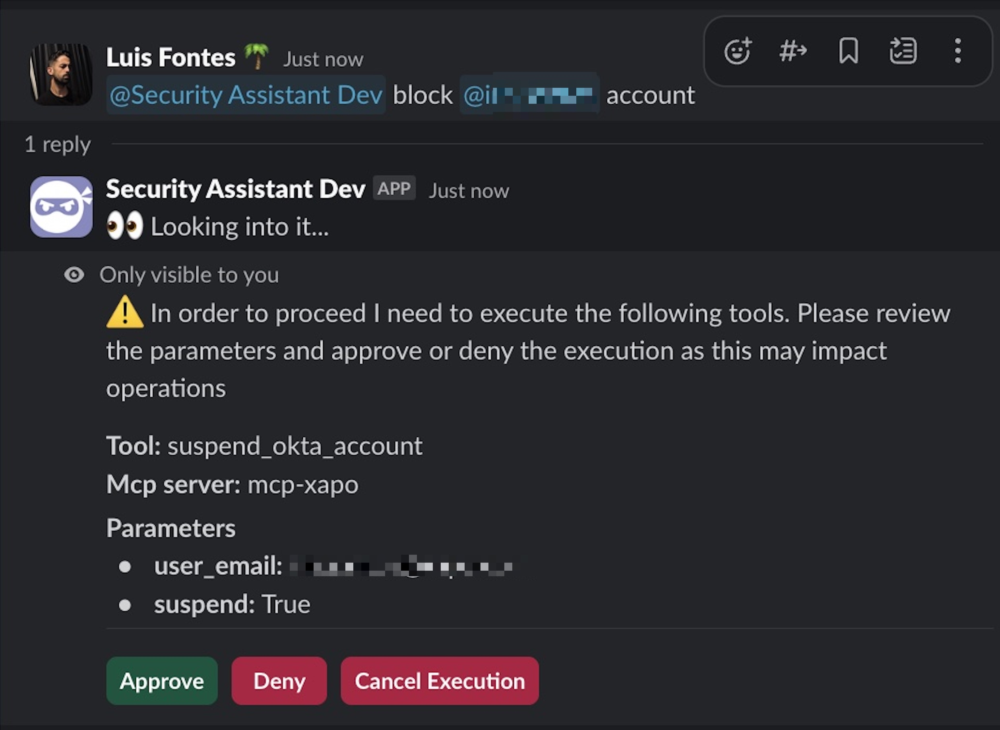

Security operations teams spend a fair amount of time on repetitive administrative tasks. Answering recurring process questions, manually triaging alerts, guiding teams through procedures, maintaining documentation and tickets. The operational overhead is substantial.

Historically, these tasks required human oversight because they demanded enough contextual understanding to need judgment calls, yet followed predictable patterns. With recent advances in LLM capabilities for understanding context and executing complex instructions, many of these operational tasks can now be effectively automated.

I built an AI-powered security assistant to handle these repetitive but crucial operational tasks. Here's the technical approach, implementation challenges, and security considerations.

## Development Stack

We work a lot with Slack. It serves as the primary channel for alert notifications, incident response coordination, or just security related help topics. Integrating the assistant directly into Slack made sense to leverage existing workflows.

Slack's mobile accessibility provides additional operational flexibility, allowing security engineers to interact with the assistant remotely when needed. Since security discussions typically originate in Slack channels, embedding the assistant directly into these conversations creates a more integrated workflow.

AWS Lambda provided the optimal backend architecture for this use case. The serverless model offers cost efficiency and automatic scaling without infrastructure management overhead.

The initial implementation focused on conversational capabilities covering internal processes and procedures, vulnerability management workflows, incident response protocols. While effective for general inquiries, the assistant struggled with organization-specific contexts and edge cases.

## Power up with MCP & Tools

To make the assistant actually *do* things instead of just talking about them, I built out a collection of tools such as:

- 🚫 Block/Unblock employees' accounts
- 🔓 Manage firewall exceptions
- 🚨 Create and manage security incidents
- 📚 Search through internal playbooks
- 🔍 Query security related logs
- 📋 Manage vulnerability program's manual events

However, tools integration had significant architectural challenges. Existing tools were distributed across AWS services, internal servers, and various manually run scripts. Integration patterns were inconsistent.

MCP (Model Context Protocol) provided a solution to this integration complexity. Rather than maintaining custom integrations for each tool, MCP offers a standardized interface for tool discovery and execution. I developed internal MCP servers to consolidate our security tooling and migrated the existing tools to this unified architecture.

A critical enhancement was exposing MCP capabilities directly within Slack. This allows users to inspect available tools, review their documentation, and manually trigger specific functions through the Slack interface while maintaining proper authorization controls.



## Prompting & Context

The system prompt covers our specific processes, but the real magic happens with dynamic context injection. The assistant can pull in relevant information as needed:

- 📚 Search Confluence for process documentation
- 🎫 Read Jira tickets and project details
- 👥 Look up user information across systems
- 📊 Access security dashboards and metrics

Since this runs in Slack, the assistant needs to understand Slack's formatting quirks. It knows how to properly mention users (`<@U12345>`), format messages with Slack's markdown variant, and work with Slack's threading model.

Cross-system user mapping was crucial. When someone says "block @john.doe's account," the assistant figures out that corresponds to `john.doe@company.com` in Okta, `jdoe` on GitHub, and user ID `U12345` in Slack. This kind of context stitching makes interactions feel natural instead of forcing users to remember system-specific identifiers.

## Security Considerations

The fundamental security principle: LLMs must never be trusted with autonomous security decisions.

The assistant can recommend actions and guide users through established processes, but cannot execute any operations without explicit human authorization. This constraint is enforced at the application level, not through prompt engineering. No prompt manipulation techniques can circumvent the mandatory confirmation workflow.

All MCP servers are built and maintained internally. No third-party servers, no external APIs, no mystery behavior. Every tool the assistant can access was written by our team and runs in our environment.

The bot itself is restricted to security team members only. Even then, every tool execution shows a detailed confirmation prompt with the exact tool name, parameters, and which MCP server it's running on. You see exactly what's about to happen before giving the green light.

This layered approach means that even if someone finds a way to manipulate the assistant's responses, the actual security enforcement happens outside the LLM where it can't be influenced by prompts.

## Usages

In practice, security engineers just @ the assistant in Slack channels when they need help. Whether it's during an active incident, routine maintenance, or answering process questions, the assistant slots right into existing workflows.

During incident response, it can help coordinate tasks—creating tickets, looking up runbook procedures, pulling relevant logs, and keeping stakeholders updated. Instead of having someone juggle multiple systems while trying to contain an issue, the assistant handles the administrative overhead.

For routine work, it answers the same process questions that used to interrupt senior engineers—how to request access, where to find specific documentation, what the procedure is for various security tasks. This frees up human expertise for actual security work instead of being a walking FAQ.
