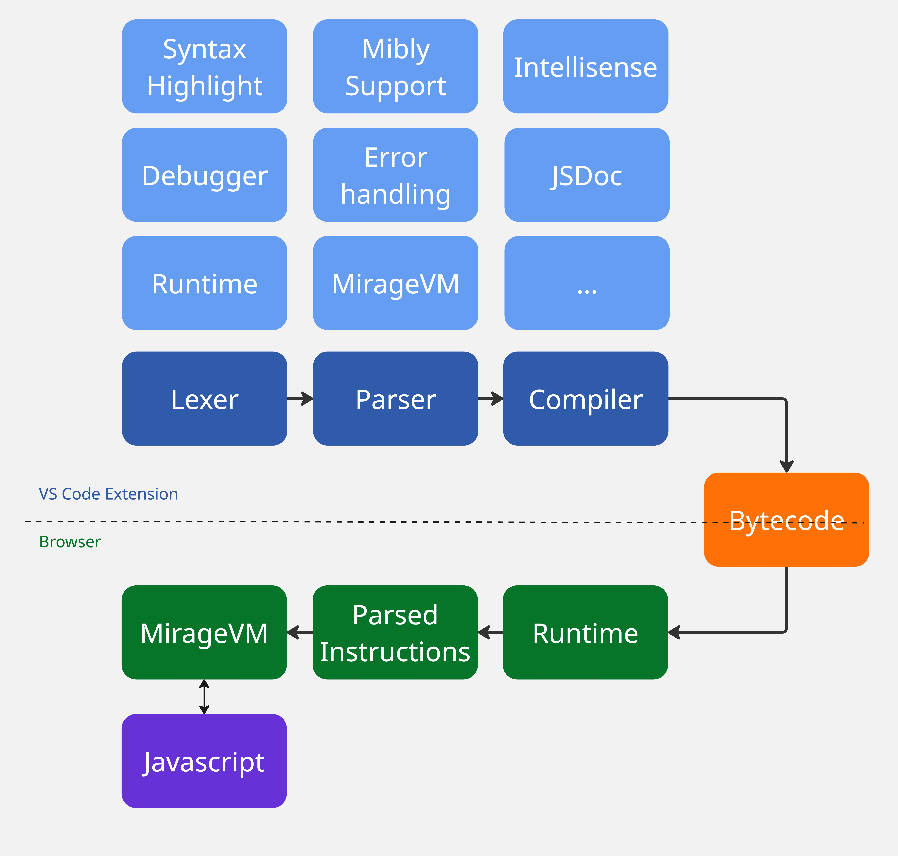
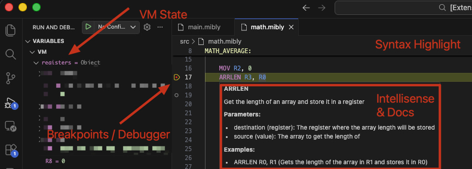
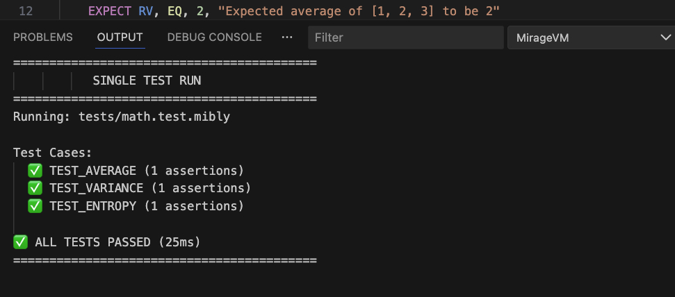
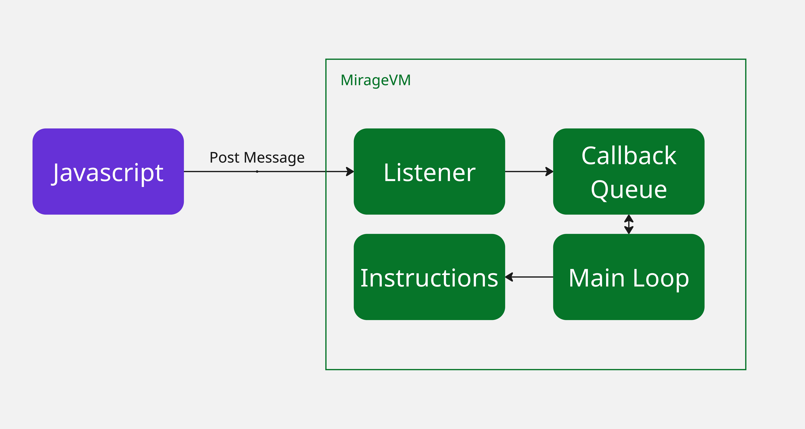

Modern web applications face a persistent challenge: automated attacks that bypass traditional security measures. Captcha farms and AI-powered tools have made it increasingly difficult to distinguish between legitimate users and malicious bots. Services like [anti-captcha](https://anti-captcha.com/) and [2captcha](https://2captcha.com/)  can solve a lot of commercially available captchas, while AI tools enable sophisticated scripts to interact with web pages in ways that mimic human behavior or even solve captchas as well.

While the response was increasing captcha challenge complexity, these often frustrate legitimate users without effectively stopping determined attackers. The escalating arms race between security measures and bypass techniques has led many to seek alternative approaches.

Google's captcha implementation is interesting: they employ a custom JavaScript virtual machine to obfuscate their captcha logic. Instead of shipping readable JavaScript code, they send bytecode that executes within a custom VM. This technique hides the actual implementation behind a layer of abstraction, making reverse engineering significantly more challenging.

The concept of building a VM excited me enough to try building something similar. What started as a "proof of concept" experiment quickly evolved into a multi-month project.

## Why a JavaScript VM?

A JavaScript virtual machine for obfuscation works by replacing standard JavaScript with custom bytecode. Instead of sending readable code to the browser, you ship low-level instructions that only your custom VM can execute. Each high-level operation might require multiple VM instructions, similar to how a single line of C code translates to multiple assembly instructions.

This approach creates several layers of protection. First, attackers must understand how the VM interprets bytecode, which is heavily obfuscated. Second, they need to reverse-engineer the instruction set. Finally, they must map low-level operations back to high-level logic. It's like trying to understand a program by reading assembly code, except this language and its runtime are entirely custom and undocumented.

For example, to call the JavaScript `Date.now()` function, the VM requires multiple instructions:

```mibly
GLOBAL R0             // Load globalThis object into register R0
GET R0, R0, "Date"    // Access the Date property from globalThis
EXEC R1, R0, "now"    // Invoke the now method from Date object
PRINT R1              // Print the result
```

This low-level approach increases the complexity of reverse-engineering efforts, as attackers must decipher multiple instructions to understand even basic functionality.

## Architecture

At its core, MirageVM is a state machine that reads and executes bytecode instructions. The implementation follows traditional CPU architecture patterns, featuring registers for data storage and a stack for managing function calls and local variables.



### The Virtual Machine Core

The VM maintains its state through several core components:

* **Registers**: 16 total registers
* **Instructions**: Array of bytecode instructions loaded into the VM
* **Variables**: Key-value memory storage beyond registers
* **Stack**: Call stack for managing function calls and local variables
* **Callback Queue** : Manages asynchronous callbacks from JavaScript

The execution engine includes cooperative multitasking - it periodically yields control back to the JavaScript event loop to prevent blocking on long-running operations. This is crucial for maintaining responsiveness in a browser environment.

### Instruction Set Architecture

MirageVM supports over 60 opcodes covering:

* Arithmetic operations
* Logical operations
* Control flow
* Data Manipulation (Arrays, Strings, Objects, etc)
* JavaScript integration
* Advanced features

Each instruction follows a consistent format with an opcode followed by parameters:

```mibly
MOV R0, "Hello"        // Move string "Hello" to register R0
ADD R1, 42             // Add 42 to register R1
JMP LOOP_START         // Jump to label LOOP_START
CALL FUNCTION_NAME     // Call function, push return address
```

**"Mibly"** (MirageVM + Assembly) is the name of the assembly-like language that compiles to Mirage bytecode. It provides a human-readable syntax for writing VM programs

## Challenges

### 1. Structuring the VM

Building a virtual machine from scratch presented several architectural challenges. The core design follows traditional CPU emulator patterns with some modern adaptations.

**Register Architecture**: The VM uses 16 registers total - 11 general-purpose registers (R0-R10) plus 5 special-purpose registers. Values in registers are encrypted in memory to make runtime analysis more difficult.

**Stack Management**: While the VM emphasizes register-based operations, a stack is essential for function calls and temporary storage. The stack handles return addresses and enables proper function call nesting.

### 2. Tools code in Mibly

After building a minimal functional VM, writing mibly code by hand became impractical. The initial process used a simple Monaco editor in a webpage, but this quickly showed its limitations as programs grew in complexity.

The solution was migrating to a comprehensive VS Code extension that provides multiple benefits



**Full Language Support**: Complete syntax highlighting, intelligent autocompletion, and real-time error checking for Mibly code. The language server analyzes the instruction set and provides context-aware suggestions.

**Compiler**: A three-phase compilation process:

* **Tokenizer**: Breaks source code into discrete tokens (instructions, labels, literals, comments)
* **Parser**: Assembles tokens into structured instructions, validates syntax, and resolves references
* **Compiler**: Converts parsed instructions into bytecode

**Integrated Debugger**: Step-through debugging with full VM state inspection. Developers can set breakpoints, examine registers, monitor the stack, and trace instruction execution in real-time.

**Multi-file Support**: A module system with `REQUIRE` statements enables code organization across multiple files. The compiler handles dependency resolution and ensures labels work correctly across file boundaries.

**Testing Framework**: Built-in unit testing with the `EXPECT` instruction for assertions



### 3. Integrating with JavaScript

The most technically challenging aspect was bridging the gap between the VM's synchronous instruction model and JavaScript's asynchronous, event-driven architecture.

**JavaScript Function Integration**: Rather than reimplementing JavaScript's entire function library, the VM exposes key JavaScript concepts through special opcodes

This approach allows the VM to leverage JavaScript's rich ecosystem while maintaining the obfuscation benefits.

Javascript globals are accessible via the `GLOBAL` instruction which exposes the `globalThis` JS object, where standard globals like `document`, `window`, and `console` live.

**Callback System**: JavaScript's callback-heavy nature required significant architectural changes. The original VM followed a simple pattern: execute instruction, increment program counter, repeat. Callbacks shattered this model by introducing functions that could be invoked at arbitrary future times.

The solution uses a callback queue system inspired by the JavaScript's event loop. When a callback executes, the VM:

1. Suspends main execution
2. Processes the callback to completion (determined by monitoring call stack depth)
3. Resumes normal instruction processing

**Event-Driven Execution**: The VM implements a background execution mode for handling events even after the main program completes. This allows Mibly code to respond to user interactions and asynchronous events seamlessly.

**Communication Channels**: The VM communicates with the host environment using JavaScript's `postMessage` API. This creates a clean separation between obfuscated VM logic and the main application



### 4. VSCode & Node.js Limitations

Developing the VM within a VS Code extension introduced platform compatibility challenges. Code intended to run in browsers often isn't compatible with the Node.js environment used by VS Code extensions.

**Browser API Mocking**: The solution involved creating a mock system for browser-specific APIs. A Mibly project can include an override file that defines custom implementations for browser objects:

```javascript
// overrides.js - Mock browser APIs for development
module.exports = {
    document: {
        addEventListener: (eventName, callback) => {
            if (eventName !== "mousemove") {
                throw new Error(`Event ${eventName} not mocked`)
            }
            // Simulate mouse movements for testing
            let y = 0
            return setInterval(() => {
                callback({ clientX: 0, clientY: y++ })
            }, 10)
        }
    }
}
```

This allows developers to test browser-specific functionality within the VS Code environment while ensuring the real browser APIs work correctly in production.

### 5. Labels and Cross-File Resolution

Like traditional assembly languages, Mibly needed support for labels to make control flow readable and maintainable. Writing jump instructions with raw instruction indices would make the code nearly impossible to work with:

```mibly
LOOP_START:
    MOV R0, "Processing..."
    PRINT R0
    SUB R1, 1
    JNZ LOOP_START    // Much cleaner than JNZ 0x42
```

From a security perspective, I wanted labels to disappear entirely from the compiled bytecode. Labels provide structural information that makes reverse engineering easier - they leak where important code sections begin. So the compiler was designed to resolve all labels to instruction indices at compile time, stripping away this helpful metadata.

This worked perfectly for single files, but introducing multi-file support through the `REQUIRE` opcode created a significant headache. When code spans multiple files, you can't resolve labels until you know the final layout of all instructions across all files. A label in file A might reference a position that depends on how many instructions file B contributes.

The initial naive approach of resolving labels file-by-file predictably broke down immediately. Labels pointing to other files would resolve to incorrect addresses, and the VM would jump to random instructions with catastrophic results.

**The Three-Phase Solution**: The compilation process was restructured to solve this:

1. **Dependency Resolution**: First, load all required files and build the complete dependency tree
2. **Global Assembly**: Parse all files into a single structure. Now that all instructions are known, calculate the final instruction indices for every label across all files is easy.
3. **Label Resolution**: Resolve every label to its final instruction index

This approach meant significantly more complexity in the compiler, but it solved the cross-file label problem while maintaining the security benefit of completely removing label names from the final bytecode. The compiled program contains only numeric jump addresses, making control flow analysis much more difficult for anyone trying to reverse-engineer the code.

At this moment there is no namespace support, so label names must be unique across all files in a project. This is a limitation to address in future versions.

### 6. Debug Hardening and Code Isolation

One of the biggest challenges was making the VM genuinely difficult to debug and reverse-engineer. While I'd invested heavily in code organization - clean architecture, verbose variable names, comprehensive documentation - this very clarity became a liability when the code reached production.

Even with aggressive obfuscation, critical information was leaking through the compiled runtime. Instruction mappings, opcode definitions, error messages, and compiler logic were all embedded in the final bundle. A determined reverse engineer could extract enum definitions, understand the instruction set architecture, and map opcodes to their functionality just by examining the obfuscated code structure.

TypeScript offered configurations that could help strip some of this metadata, but enabling them broke fundamental patterns throughout the codebase. The type system and enum structures that made development manageable were exactly what was exposing implementation details.

**The PrivateCode Solution**: A strict separation between development-time information and runtime execution. All sensitive implementation details were moved into a `privateCode` folder containing:

* Instruction mapping and opcode definitions
* Compiler logic and parsing rules
* Error code mappings and debug information
* Internal opcode documentation and architecture details

Custom ESLint rules were implemented to prevent any file outside the `privateCode` folder from importing these sensitive modules. This created a hard boundary - the browser runtime could never accidentally include sensitive code, because the linting process would catch and reject such imports.

The VM runtime that actually ships to browsers lives entirely outside this protected folder, ensuring that no sensitive architectural information can leak into the production bundle.

**The Trade-off**: This separation created its own challenges. The most significant was that opcode interpretation logic could no longer reference enum variables or constants. Instead, instruction handlers had to hardcode opcode numbers directly:

```javascript
// Before
if (instruction === OpCodes.MOVE) { ... }

// After
if (instruction === 0x1337) /* MOVE */ { ... }
```

This made the runtime code a bit harder to maintain and more prone to errors during development. But it achieved the security goal: the production runtime contains only numeric constants with no mapping back to their semantic meaning. A reverse engineer seeing `0x1337` has no immediate indication that this represents a MOVE instruction.

Of course 0x1337 is just an example, and comments are fully removed from the final bundle.

## First Program

From the beginning, MirageVM was being developed in parallel with a mibly program designed to distinguish automated requests from legitimate user interactions.

This bot detection logic employs multiple telemetry collection techniques to build a behavioral profile. Rather than relying on simple captchas or basic fingerprinting, the system analyzes patterns like timing between events, mouse movement characteristics, keyboard input patterns, browser environment inconsistencies, and other behavioral markers.

The complexity of this detection logic became the primary driver for VM feature development. Analyzing user interactions required comprehensive DOM event handling. Building behavioral profiles needed complex data structures and mathematical operations. The need for such sophisticated logic pushed the VM to support most use cases achievable with regular JavaScript code.

The result is a program containing over 1,000 Mibly instructions that can detect automation attempts with reasonable accuracy. The VM needed to support everything from cryptographic operations for securing telemetry data, to complex mathematical functions for scoring algorithms, to asynchronous operations for real-time analysis.

This real-world testing revealed which VM features were truly essential versus nice-to-have additions. It also demonstrated that the obfuscation approach was viable for non-trivial applications - if you can implement sophisticated bot detection entirely within the VM, you can likely handle other security-sensitive logic.

The bot detection program became both the VM's primary test case and its most compelling demonstration of practical utility.

## Securing the VM

MirageVM implements multiple layers of obfuscation to help against reverse-engineering attempts:

**Code Obfuscation**: The entire VM runtime is heavily obfuscated using custom techniques beyond standard JavaScript obfuscators. Of course every new build produces completely different code flows and variable names.

**Entropy Injection**: Large chunks of code execute during runtime but don't contribute to VM logic, they exist purely to confuse reverse engineers and make static analysis more difficult.

**String Obfuscation**: All strings in Mibly code are obfuscated in the bytecode. The deobfuscation algorithm requires understanding the VM internals first

**Runtime Encryption**: Register values are kept encrypted in memory, only being decrypted when used in operations. This adds another layer of complexity for runtime analysis.

**Label Elimination**: All labels are resolved to instruction indices during compilation, removing structural information from the final bytecode. This makes control flow analysis significantly harder.

## Improvements & Future Plans

**Polymorphic Instruction Sets**: A planned feature would generate different opcode mappings for each build. Instead of having fixed opcodes, the VM and compiler would use random instruction sets per version, making reverse-engineering efforts harder for each update.

**System Libraries**: Pre-compiled Mibly modules providing common functionality like DOM manipulation, cryptographic operations, and data structures. These would function like standard libraries, enabling rapid development of complex applications.

**Higher-Level Language**: A potential future project involves creating a higher-level language that compiles to Mibly bytecode, providing abstractions like loops, conditionals, and functions without requiring low-level instruction management.

## Notes on Vibecoding

A significant portion of this project (and blog post) was developed using AI, which provided both benefits and challenges:

**Rapid Prototyping**: AI excelled at bootstrapping the initial project structure and generating working prototypes quickly. The basic VM architecture and instruction implementations were largely AI-generated.

**Context Limitations & Code Quality**: As the project grew, AI began losing track of previously implemented features, sometimes rewriting existing logic or making decisions that contradicted earlier design choices. Deep reviews, manual corrections and refactors were a big part of the process.

**Task Granularity**: Breaking problems into very small, specific tasks yielded much better results. Detailed explanations of requirements, existing code context, and expected outcomes were crucial for useful AI generated code.

**Documentation and tests**: AI was particularly effective at generating documentation for each instruction based on existing code as well as generating complex unit tests with high coverage.

**Mixed Success**: Some components, particularly the VS Code extension services, were entirely AI-generated and had no modifications, although the code doesn't look great AI can easily maintain it as they function as small and independent units. Others scenarios needed substantial human review and rewriting to maintain code quality and consistency.

AI is an excellent tool for rapid iteration and handling well-defined, isolated tasks, but human oversight remains essential for architectural decisions and code quality.
